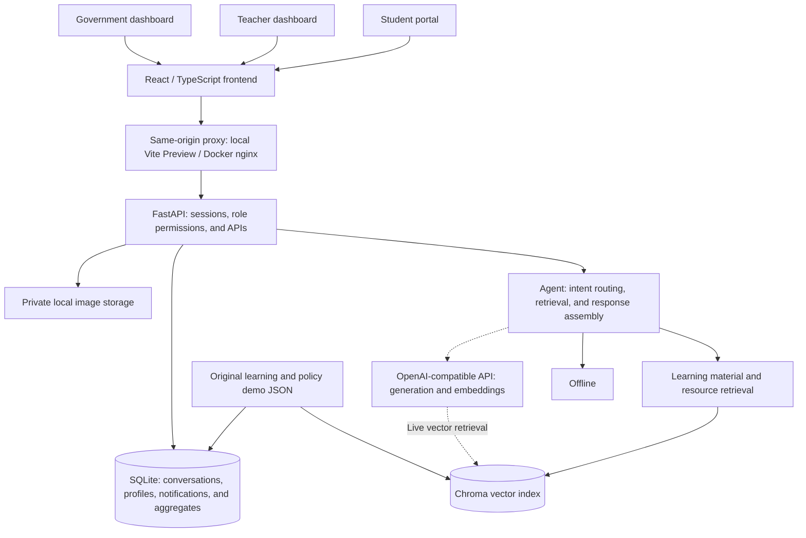

# Fellow 學伴 [Hackathon]

[繁體中文](README.md) | **English**

For judges: [Judge reference guide (Traditional Chinese)](評審參考文件.md) · [Complete documentation index (Traditional Chinese)](https://github.com/Jo-Leo-35/Fellow/blob/main/docs/README.md)

<p align="center">
  
</p>

<p align="center">
  Every question opens a door to learning and everyday support.<br />
  讓每一次提問，都成為獲得學習支持與生活協助的起點。
</p>

## Problem and Goals

Students in rural communities may not have immediate access to individual explanations when they struggle with schoolwork. Their families may also find it difficult to navigate scattered public assistance information and eligibility requirements, and those family-level challenges often become concerns for the students themselves. Teachers and public agencies need to understand where support is most needed while protecting student privacy.

Fellow brings learning Q&A, interactive teaching animations, and family resource discovery into one student-facing experience. It turns abstract concepts and complex information into understandable explanations and practical next steps. Teachers receive learning summaries within their authorized scope, while government users see aggregated, anonymous demand statistics. The goal is to make support easier to access and inform teaching and resource allocation.

The current release runs in `offline_demo` mode. Frontend and backend APIs, role permissions, and persistent storage are connected. Responses use original, predefined AI-generated data and local retrieval without calling external AI models, reducing security exposure; feasibility has also been tested with local models. Students verified by government agencies as low-income or living in rural communities can enter without an access code and have no daily question limit.

## Core Features

- **Learning Q&A and interactive animations**: Six topics—Newtonian mechanics, thermodynamics, entropy, chemical equilibrium, chemical bonding, and reaction rates—with everyday analogies, worked explanations, material citations, practice questions, and interactive animations. Future partnerships with publishers could add more curriculum-aligned learning materials.
- **Personalized public resource discovery**: Six categories—disasters, agriculture, education, financial support, health, and other needs—with demonstration resources, conditions to verify, document checklists, and next steps. Saving information as memory requires student consent, and memories can be deleted.
- **Notifications and conversation history**: View demonstration notifications, open their details, and mark them as read. Conversations, citations, uploaded images, and profiles persist across page reloads.
- **Teacher learning insights**: Filter authorized rosters and learning summaries by class, subject, and period; browse materials, plan review activities, and export CSV files.
- **Anonymous government insights**: Explore demand trends and aggregates by region, period, and topic, with filtering and CSV export. Government APIs do not expose raw student conversations or personal family information.

## System Architecture

Files are grouped by purpose: [frontend/](frontend/README.md), [backend/](backend/README.md), [deploy/](deploy/README.md), [scripts/](scripts/README.md), and [docs/](docs/README.md). Judge guides, presentation deliverables, design specifications, and asset notes are under `docs/`. Shared npm configuration and a Compose compatibility entry point remain at the repository root; existing commands still run from there.



The frontend shares components and an API client across three roles. Backend sessions determine which data each role can access. The Agent routes questions to a learning or resource workflow, retrieves relevant content, and assembles a response with citations and suggestions. SQLite stores conversations and structured results; Chroma stores retrieval indexes. The backend checks image ownership before serving uploads.

Offline retrieval uses reproducible feature-hash vectors and requires no model download. The code includes an OpenAI-compatible SDK interface for text generation and embeddings. Enabling `live` mode still requires provider settings, model choices, server-side credentials, rebuilding the appropriate index, and response-quality validation.

Teachers receive only authorized teaching summaries; government users receive only anonymous demand aggregates. Teacher review plans, government tracking lists, and some preferences currently use browser localStorage.

Technical details: [API contract](docs/api-alignment.md), [deployment and operations guide](docs/demo-runbook.md), and [integration verification report](docs/integration-report.md). These supporting documents are in Traditional Chinese.

## Technologies

| Category | Technology / Service | Purpose |
| --- | --- | --- |
| AI models | Predefined offline responses, feature-hash vectors, OpenAI-compatible API interface | Demonstrates Q&A and retrieval; live generation and embedding models remain to be configured |
| Frontend | React 18, TypeScript, Vite, Chakra UI, TanStack Query | Role-specific interfaces, state management, and API integration |
| Visual interaction | Apache ECharts, Framer Motion, Lucide, CSS | Charts, interactive animations, and icons |
| Backend | Python 3.12, FastAPI, Pydantic, Uvicorn | APIs, validation, sessions, and role permissions |
| Databases | SQLite, SQLAlchemy, Chroma | Structured data, conversation persistence, and vector indexing |
| File processing | Pillow, python-multipart | Image validation and uploads |
| Execution and verification | Python launcher, Playwright, unittest; optional Docker Compose | Local demonstrations and browser/API checks |
| Sponsor technology | OpenAI Python SDK for the live interface; OpenAI-generated image assets | The SDK is integrated but makes no model calls offline. See asset provenance below; the team must confirm sponsor selections on the submission form |

Version references: [frontend packages](package.json), [frontend lockfile](package-lock.json), and [backend requirements](backend/requirements.txt).

## Installation and Execution

The local launcher currently targets Linux / WSL and uses `/proc` to manage service processes. Prerequisites are Git, Node.js 22, npm, Python 3.12, and working `pip` and `venv` modules. Installing dependencies for the first time requires internet access. The offline Demo does not require an external AI key, and an Agent can be added in the future.

```bash
# Clone the project for the first time
git clone https://github.com/Jo-Leo-35/Fellow.git
cd Fellow

# Check prerequisites
node --version
npm --version
python3 --version
python3 -m pip --version

# Preserve existing settings; newly generated settings use offline_demo
[ -f .env ] || python3 scripts/create-demo-env.py --port 45465

# Install dependencies, prepare data and indexes, build, and start in the background
python3 scripts/local-demo.py start

# Check process status and API health
python3 scripts/local-demo.py status
curl --fail http://localhost:45465/health
```

If you are using the existing development workspace, first run `cd ~/workspace/FutureAI`, then continue with configuration and startup.

After startup, open these local endpoints. They are for reproducing the project locally, not public demo URLs for the submission form; an ngrok proxy will be used later.

| Entry | Local URL |
| --- | --- |
| Student homepage | <http://localhost:45465/index.html> |
| Teacher dashboard | <http://localhost:45465/teacher.html> |
| Government dashboard | <http://localhost:45465/government.html> |
| API documentation | <http://localhost:45465/docs> |

The frontend binds only to `127.0.0.1:45465`; the backend binds only to `127.0.0.1:45466`. Browser API calls use the frontend's same-origin `/api/v1` proxy. Access from another computer requires private port forwarding to the machine running the services.

```bash
# Rebuild and restart after updating the source
python3 scripts/local-demo.py restart

# Stop local services
python3 scripts/local-demo.py stop

# Frontend type checking and build
npm run typecheck
npm run build

# Backend tests use isolated test data
PYTHONPATH=backend ANONYMIZED_TELEMETRY=False .venv/bin/python -m unittest discover -s backend/tests -v
```

Python packages live in `.venv/`; runtime data and logs live in `runtime/local-demo/`. These directories and the private `.env` file are excluded by `.gitignore`. Restarting preserves local data; a fresh environment creates fictional Demo data. Full browser verification and optional Docker Compose deployment instructions are in the [operations guide](docs/demo-runbook.md) and [integration report](docs/integration-report.md).

## Project Demo

- [Technical documentation for judges](docs/README.md): architecture, frontend and backend specifications, API contracts, deployment, and verification records, with supplementary HTML/PDF feature guides in Traditional Chinese.

| Feature guide | Document |
| --- | --- |
| Learning Q&A and interactive animations | [PDF](docs/judges/01-學習問答與互動動畫.pdf) |
| Public resource recommendations | [PDF](docs/judges/02-公共資源推薦.pdf) |
| Notifications and next-step reminders | [PDF](docs/judges/03-主動通知與下一步提醒.pdf) |
| Teacher insights and review plans | [PDF](docs/judges/04-教師學習洞察與複習計畫.pdf) |
| Anonymous government demand insights | [PDF](docs/judges/05-政府匿名需求洞察.pdf) |

Suggested walkthrough: enter **「請解釋牛頓第二定律」** (“Please explain Newton's second law”) as a student and explore the answer, citations, and animation. Then enter **「家裡菜園颱風受損，有補助嗎？」** (“Our family's vegetable garden was damaged by a typhoon. Is assistance available?”) to try resource discovery. Finish with the teacher and government dashboards. Use the Chinese prompts as shown; this English README does not imply that the Demo supports English questions or an English interface.

## Limitations and Future Work

- **Limited response coverage**: The Demo uses predefined responses for six science topics, six resource categories, and supported follow-ups. Unsupported questions receive an explicit error. Future work includes live model integration and evaluation of retrieval and answer reliability.
- **No image understanding yet**: JPEG/PNG uploads are stored, but offline answers use text only, without OCR or visual interpretation. Image understanding and related error handling remain future work.
- **Policies are demonstration content**: There is no live government-policy feed, and recommendations do not establish eligibility. Unknown sources, deadlines, and conditions are not fabricated. Future work includes official-source updates and verification.
- **Demo identities**: Offline entry points sign in to fixed roles automatically. This is not a production registration or school login system. Deployment requires full identity, authorization, and privacy workflows.
- **Insights and notifications need further development**: Current data includes fictional seed records and demonstration notifications. Generating a question or showing an animation does not mean a student answered it or completed a learning activity. Future work includes validated activity tracking, teaching metrics, notification scheduling, and push delivery.
- **Local deployment and collaboration**: Some dashboard preferences are browser-local. Future work includes cross-device synchronization, backups, and multi-user deployment. No public demo site or real-world outcome data is currently provided.

## Third-Party Services, Data, and Assets

License names below come from the currently installed packages' license metadata and files. Retain the notices supplied with each package when using or redistributing it. For transitive dependencies, also consult lockfiles and installed LICENSE / NOTICE files.

| Item | Source / Link | License / Notes |
| --- | --- | --- |
| React, React DOM | [facebook/react](https://github.com/facebook/react) | MIT |
| Vite, React plugin | [vitejs/vite](https://github.com/vitejs/vite), [vite-plugin-react](https://github.com/vitejs/vite-plugin-react) | MIT |
| TypeScript | [microsoft/TypeScript](https://github.com/microsoft/TypeScript) | Apache-2.0 |
| Chakra UI, Emotion | [chakra-ui](https://github.com/chakra-ui/chakra-ui), [emotion](https://github.com/emotion-js/emotion) | MIT |
| TanStack Query, React Router | [TanStack/query](https://github.com/TanStack/query), [react-router](https://github.com/remix-run/react-router) | MIT |
| React Hook Form, Zod | [react-hook-form](https://github.com/react-hook-form/react-hook-form), [zod](https://github.com/colinhacks/zod) | MIT |
| Framer Motion | [motiondivision/motion](https://github.com/motiondivision/motion) | MIT |
| ECharts, React wrapper | [apache/echarts](https://github.com/apache/echarts), [echarts-for-react](https://github.com/hustcc/echarts-for-react) | Apache-2.0 / MIT |
| Lucide icons | [lucide-icons/lucide](https://github.com/lucide-icons/lucide) | ISC; derived icons follow the package's accompanying notices |
| Noto Sans TC font | [Fontsource Noto Sans TC](https://fontsource.org/fonts/noto-sans-tc) | SIL Open Font License 1.1 (OFL-1.1) |
| FastAPI, Pydantic, Pydantic Settings | [fastapi](https://github.com/fastapi/fastapi), [pydantic](https://github.com/pydantic/pydantic), [pydantic-settings](https://github.com/pydantic/pydantic-settings) | MIT |
| SQLAlchemy | [sqlalchemy](https://github.com/sqlalchemy/sqlalchemy) | MIT |
| Uvicorn | [Kludex/uvicorn](https://github.com/Kludex/uvicorn) | BSD-3-Clause |
| python-multipart | [Kludex/python-multipart](https://github.com/Kludex/python-multipart) | Apache-2.0 |
| Pillow | [python-pillow/Pillow](https://github.com/python-pillow/Pillow) | MIT-CMU |
| OpenAI Python SDK | [openai/openai-python](https://github.com/openai/openai-python) | Apache-2.0; external model services have separate terms and are not called offline |
| Chroma | [chroma-core/chroma](https://github.com/chroma-core/chroma) | Apache-2.0 |
| Playwright | [microsoft/playwright](https://github.com/microsoft/playwright) | Apache-2.0 |
| TypeScript type definitions | [DefinitelyTyped](https://github.com/DefinitelyTyped/DefinitelyTyped) | MIT |
| Learning and policy content | [Learning materials](backend/data/curriculum), [policy data](backend/data/policies) | Original demonstration content under Apache-2.0; not actual policy announcements or third-party textbook reproductions |
| Demo people and events | [seed.py](backend/scripts/seed.py), [notification data](backend/data/alerts) | Fictional project data under Apache-2.0, for demonstrations and tests |
| Mascot, avatars, and regional illustrations | [Asset inventory](docs/assets/README.md), [creation notes](docs/reference-asset-prompts.md) | Includes OpenAI-generated images and derivatives of a supplied reference image. The team must confirm reference provenance and redistribution rights; these images are not automatically covered by the code license |

Submit fictional Demo data only. Do not commit `.env`, API keys, tokens, runtime databases, real personal information, or user uploads. See [ASSETS.md](docs/assets/README.md) for asset creation details and replacement locations.

## Team Members

| Name | Responsibilities |
| --- | --- |
| Hachiware | Frontend development, backend development, and system architecture design |
| Robyn | Product ideation, backend development, and data analysis |
| Momonga | Product ideation, frontend visual design, and UI/UX |

## License

The project's original source code and documentation are licensed under **Apache License 2.0 (Apache-2.0)**. See the complete terms in the root [LICENSE](LICENSE) file.

Third-party packages and assets retain their own licenses or terms. Reference images and derivatives marked above as awaiting rights confirmation are excluded from the project license.
