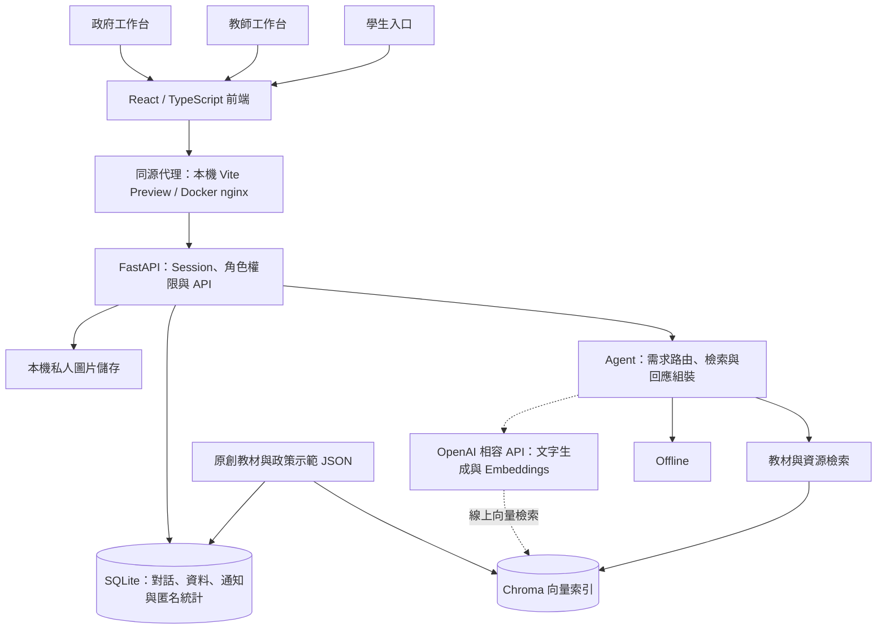

# Fellow 學伴 [黑客松比賽]

**繁體中文** | [English](README.en.md)

評審入口：[評審參考文件：完整產品介紹與功能導覽](docs/README.md)

<p align="center">
  
</p>

<p align="center">
  讓每一次提問，都成為獲得學習支持與家庭生活協助的起點，縮短政府與個人的距離<br />
  Every question opens a door to learning support and everyday help for families, bringing people and government closer together.
</p>

## 問題與目標

偏鄉學生遇到學習困難時，不一定能即時取得個別解說；家庭需要公共資源時，也可能因資訊分散、資格難懂而錯過求助方向，而這往往也在偏鄉學生的煩惱之中。教師與公共部門則需要在保護學生隱私的前提下，理解哪些學習與生活需求值得優先支援。

Fellow 學伴以學生為主要使用者，結合學習問答、互動教學動畫與家庭資源查詢，將抽象知識與複雜資訊轉成容易理解的說明和下一步。同時提供教師授權範圍內的學習摘要，以及政府端的匿名需求統計，期望降低求助門檻，協助教學與資源配置。

目前展示版本為 `offline_demo`：前後端 API、角色權限與資料保存已串接；回答使用原創預設內容 (AI-generated data) 與離線檢索，，不呼叫外部 AI 模型，避免資安相關議題，可行性以透過本地模型測試。學生若經政府單位驗證為低收或是偏鄉，可免輸入存取碼體驗，且不限每日提問次數。

## 核心功能

- **學習問答與互動動畫**：支援牛頓力學、熱力學、熵、化學平衡、化學鍵結、反應速率六個主題，提供生活類比、解題步驟、教材引用、練習題與可操作動畫，未來可與出版商合作，補充更多課綱相關的講義。
- **個人化公共資源推薦**：涵蓋災害、農業、就學、經濟、健康與其他六類需求，提供示範資源、待確認條件、文件清單及下一步；資訊記憶須經學生同意，且可刪除。
- **通知與歷史紀錄**：展示通知、查看詳情與標記已讀；保存對話、來源、上傳圖片與個人資料，重新整理後可繼續使用。
- **教師學習洞察**：依班級、科目及期間查看授權名冊與學習摘要，瀏覽教材、安排複習並匯出 CSV。
- **政府匿名需求洞察**：依地區、期間與主題查看需求趨勢與匿名聚合，提供篩選及 CSV 匯出，不提供學生原始對話或家庭個人資料。

## 系統架構

目錄依用途分類；根目錄保留 README、授權、npm 共用設定與 Compose 相容入口。前後端業務模組維持原有結構。

```text
Fellow/
├── 評審參考文件.md         # 連結至 docs/README.md 的評審文件入口
├── frontend/              # 前端原始碼、HTML、素材與建置設定
├── backend/               # API、服務、檢索、資料與後端測試
├── deploy/                # Dockerfile、Compose、nginx 與容器啟動
├── scripts/               # 本機啟停、文件製作與驗收腳本
├── docs/                  # 技術文件與歷史紀錄
│   ├── judges/            # 評審 HTML／PDF 與整合展示
│   ├── deliverables/      # 投影片與旁白稿
│   ├── specs/             # 前端、後端與全端設計規格
│   └── assets/            # 素材說明與原始參考圖
└── runtime/               # 本機執行資料，不納入版本控制
```



前端共用元件與 API client，三個角色透過後端 session 取得各自可存取的資料。Agent 根據問題選擇學習或資源流程，檢索教材／政策資料後組裝回答、來源與建議。SQLite 保存對話與結構化結果，Chroma 保存檢索索引；圖片由後端驗證擁有者後提供下載。

目前離線檢索使用可重現的特徵雜湊向量，不需下載模型。程式已保留 OpenAI 相容 SDK 的文字生成與 embedding 介面；切換 `live` 前仍需設定 provider、模型與伺服器端金鑰，重新建立對應索引並驗證回答品質。

教師端僅取得授權教學摘要；政府端僅取得匿名需求聚合。教師複習安排、政府追蹤清單與部分偏好目前存於瀏覽器 localStorage。

技術細節：[API 契約](docs/api-alignment.md)、[部署與操作手冊](docs/demo-runbook.md)、[整合驗證紀錄](docs/integration-report.md)。

## 使用技術

| 類型 | 技術／服務 | 用途 |
| --- | --- | --- |
| AI 模型 | 離線預設回答、特徵雜湊向量；OpenAI 相容 API 介面 | 目前展示問答與檢索流程；線上生成與 embedding 模型待設定 |
| 前端 | React 18、TypeScript、Vite、Chakra UI、TanStack Query | 三角色介面、狀態管理與 API 串接 |
| 視覺互動 | Apache ECharts、Framer Motion、Lucide、CSS | 統計圖表、互動動畫與圖示 |
| 後端 | Python 3.12、FastAPI、Pydantic、Uvicorn | API、資料驗證、session 與角色權限 |
| 資料庫 | SQLite、SQLAlchemy、Chroma | 結構化資料、對話保存及向量索引 |
| 檔案處理 | Pillow、python-multipart | 圖片檢查與上傳處理 |
| 執行與驗證 | Python 啟動腳本、Playwright、unittest；可選 Docker Compose | 本機展示、瀏覽器與 API 驗證 |
| Sponsor 技術 | OpenAI Python SDK（線上介面）、OpenAI 影像生成素材 | SDK 已整合但離線執行不呼叫模型；素材來源見下節。表單贊助商使用項目仍須由團隊確認 |

版本依據：[前端套件](package.json)、[前端鎖定檔](package-lock.json)、[後端套件](backend/requirements.txt)。

## 安裝與執行

本機腳本目前以 Linux／WSL 為執行環境，使用 `/proc` 管理服務程序。需要 Git、Node.js 22、npm、Python 3.12，以及可用的 `pip` 與 `venv` 模組。首次安裝套件需連網；完成安裝後，離線 Demo 不需外部 AI key，未來可補上 Agent。

```bash
# 第一次取得專案
git clone https://github.com/Jo-Leo-35/Fellow.git
cd Fellow

# 確認執行環境
node --version
npm --version
python3 --version
python3 -m pip --version

# 已有設定檔時保留原設定；新設定檔預設使用 offline_demo
[ -f .env ] || python3 scripts/create-demo-env.py --port 45465

# 安裝相依套件、初始化資料與索引、建置前端，並在背景啟動
python3 scripts/local-demo.py start

# 確認狀態與 API
python3 scripts/local-demo.py status
curl --fail http://localhost:45465/health
```

若使用本次既有工作目錄，請先執行 `cd ~/workspace/FutureAI`，再從設定檔與啟動指令開始。

本機啟動後可開啟以下入口；這些是供自行重現的 localhost 位址，不是表單中的公開展示網址，後續會使用 ngrok 代理。

| 入口 | 本機網址 |
| --- | --- |
| 學生首頁 | <http://localhost:45465/index.html> |
| 教師工作台 | <http://localhost:45465/teacher.html> |
| 政府工作台 | <http://localhost:45465/government.html> |
| API 文件 | <http://localhost:45465/docs> |

前端只監聽 `127.0.0.1:45465`，後端只監聽 `127.0.0.1:45466`。瀏覽器透過前端的同源 `/api/v1` 代理連到後端。從另一台電腦連線時，需要私人連接埠轉送至執行服務的機器。

```bash
# 更新程式後重新建置並啟動
python3 scripts/local-demo.py restart

# 停止本機服務
python3 scripts/local-demo.py stop

# 前端型別檢查與建置
npm run typecheck
npm run build

# 後端測試使用獨立測試資料
PYTHONPATH=backend ANONYMIZED_TELEMETRY=False .venv/bin/python -m unittest discover -s backend/tests -v
```

Python 套件存於 `.venv/`，執行資料與 log 存於 `runtime/local-demo/`。這些目錄與私有 `.env` 均已列入 `.gitignore`。重新啟動會沿用本機資料；新環境則建立虛構 Demo 資料。完整瀏覽器驗收與可選的 Docker Compose 部署方式，請見 [操作手冊](docs/demo-runbook.md) 與 [整合驗證紀錄](docs/integration-report.md)。

## 作品展示

- [評審參考文件](docs/README.md)：完整產品故事、圖解、氫鍵教學案例與五大功能操作流程，並附技術文件及 HTML／PDF 導覽。

| 功能說明 | 文件 |
| --- | --- |
| 學習問答與互動動畫 | [PDF](docs/judges/01-學習問答與互動動畫.pdf) |
| 公共資源推薦 | [PDF](docs/judges/02-公共資源推薦.pdf) |
| 主動通知與下一步提醒 | [PDF](docs/judges/03-主動通知與下一步提醒.pdf) |
| 教師學習洞察與複習計畫 | [PDF](docs/judges/04-教師學習洞察與複習計畫.pdf) |
| 政府匿名需求洞察 | [PDF](docs/judges/05-政府匿名需求洞察.pdf) |

建議體驗：學生提問「請解釋牛頓第二定律」，查看回答、引用及動畫；再詢問「家裡菜園颱風受損，有補助嗎？」體驗資源查詢，最後切換教師與政府入口查看摘要及趨勢。

## 限制與未來工作

- **回答範圍有限**：目前支援六個理化主題、六類資源與既有追問，使用預設回答；超出範圍會明確回報。未來需接入並評估真實生成模型、檢索品質與回答可靠性。
- **圖片尚未辨識**：可上傳並保存 JPEG／PNG，離線回答只根據文字，不執行 OCR 或視覺理解；未來補上圖片理解與錯誤處理。
- **政策為示範資料**：目前未串接即時政府政策，推薦不代表資格核定；未知來源、期限與資格不會被編造。後續需建立官方來源更新與查核流程。
- **帳號為 Demo 身分**：離線入口可自動登入固定角色，尚非正式使用者註冊或校務登入系統。正式落地需完整身分驗證、授權與隱私流程。
- **洞察與通知仍需深化**：目前包含虛構種子資料與示範通知；產生題目或顯示動畫不代表學生已作答或完成學習。未來需驗證行為紀錄與教學指標，建置實際通知排程及推播。
- **部署與協作仍以單機為主**：部分工作台偏好保存在瀏覽器；未來可加入跨裝置同步、資料備份與多使用者部署。尚未提供公開展示網站或真實場域成效數據。

## 第三方服務、資料與素材

下列授權名稱依目前已安裝套件的授權資料列示；實際使用與再散布請保留各套件隨附的授權聲明。間接依賴請併查鎖定檔與安裝套件中的 LICENSE／NOTICE。

| 項目 | 來源與連結 | 授權方式／說明 |
| --- | --- | --- |
| React、React DOM | [facebook/react](https://github.com/facebook/react) | MIT |
| Vite、React plugin | [vitejs/vite](https://github.com/vitejs/vite)、[vite-plugin-react](https://github.com/vitejs/vite-plugin-react) | MIT |
| TypeScript | [microsoft/TypeScript](https://github.com/microsoft/TypeScript) | Apache-2.0 |
| Chakra UI、Emotion | [chakra-ui](https://github.com/chakra-ui/chakra-ui)、[emotion](https://github.com/emotion-js/emotion) | MIT |
| TanStack Query、React Router | [TanStack/query](https://github.com/TanStack/query)、[react-router](https://github.com/remix-run/react-router) | MIT |
| React Hook Form、Zod | [react-hook-form](https://github.com/react-hook-form/react-hook-form)、[zod](https://github.com/colinhacks/zod) | MIT |
| Framer Motion | [motiondivision/motion](https://github.com/motiondivision/motion) | MIT |
| ECharts、React wrapper | [apache/echarts](https://github.com/apache/echarts)、[echarts-for-react](https://github.com/hustcc/echarts-for-react) | Apache-2.0／MIT |
| Lucide 圖示 | [lucide-icons/lucide](https://github.com/lucide-icons/lucide) | ISC；衍生圖示依套件附帶聲明 |
| Noto Sans TC 字型 | [Fontsource Noto Sans TC](https://fontsource.org/fonts/noto-sans-tc) | SIL Open Font License 1.1（OFL-1.1） |
| FastAPI、Pydantic、Pydantic Settings | [fastapi](https://github.com/fastapi/fastapi)、[pydantic](https://github.com/pydantic/pydantic)、[pydantic-settings](https://github.com/pydantic/pydantic-settings) | MIT |
| SQLAlchemy | [sqlalchemy](https://github.com/sqlalchemy/sqlalchemy) | MIT |
| Uvicorn | [Kludex/uvicorn](https://github.com/Kludex/uvicorn) | BSD-3-Clause |
| python-multipart | [Kludex/python-multipart](https://github.com/Kludex/python-multipart) | Apache-2.0 |
| Pillow | [python-pillow/Pillow](https://github.com/python-pillow/Pillow) | MIT-CMU |
| OpenAI Python SDK | [openai/openai-python](https://github.com/openai/openai-python) | Apache-2.0；外部模型服務另依服務條款，離線執行不呼叫 |
| Chroma | [chroma-core/chroma](https://github.com/chroma-core/chroma) | Apache-2.0 |
| Playwright | [microsoft/playwright](https://github.com/microsoft/playwright) | Apache-2.0 |
| TypeScript 型別定義 | [DefinitelyTyped](https://github.com/DefinitelyTyped/DefinitelyTyped) | MIT |
| 教材與政策內容 | [教材資料](backend/data/curriculum)、[政策資料](backend/data/policies) | 專案原創示範內容，採 Apache-2.0；非真實政策公告或第三方教材全文 |
| Demo 人物與事件 | [seed.py](backend/scripts/seed.py)、[通知資料](backend/data/alerts) | 專案虛構資料，採 Apache-2.0，用於展示與測試 |
| 吉祥物、頭像及區域插畫 | [素材清單](docs/assets/README.md)、[製作紀錄](docs/reference-asset-prompts.md) | 含 OpenAI 影像生成素材及指定參考稿衍生圖；參考稿來源與對外散布權利待團隊確認，不逕列入專案程式碼授權 |

提交內容應使用虛構 Demo 資料；不要提交 `.env`、API key、Token、執行資料庫、真實個人資料或使用者上傳檔案。素材製作方式與替換位置詳見 [ASSETS.md](docs/assets/README.md)。

## 團隊成員

| 姓名 | 分工 |
| --- | --- |
| Hachiware | 前端開發、後端開發、系統架構設計 |
| Robyn | 產品發想、後端開發、數據分析 |
| Momonga | 產品發想、前端主視覺設計、UI/UX |

## License

本專案原創程式碼與文件採用 **Apache License 2.0（Apache-2.0）**，完整條款見根目錄 [LICENSE](LICENSE)。

第三方套件與素材仍各自依其授權或使用條款處理；上節標示權利待確認的參考稿與衍生圖像不包含在本專案授權範圍內。
