# Fellow 學伴｜從一個學習問題，走向完整的支持系統

**學生敢問、家庭找得到協助、教師看見需要，公共部門理解需求。**

小晴是一位來自農業家庭的高中生。晚上複習化學時，她分不清「氫鍵」與「共價鍵」；家裡最近也為收入不穩定而煩惱。對她而言，學習與生活不是分開發生的事。

Fellow 學伴從這個日常出發：先陪學生釐清不懂的概念，再在適當授權下協助尋找公共資源、提醒下一步，讓教師提早提供支持；最後以匿名聚合訊號協助公共部門改善資源服務。

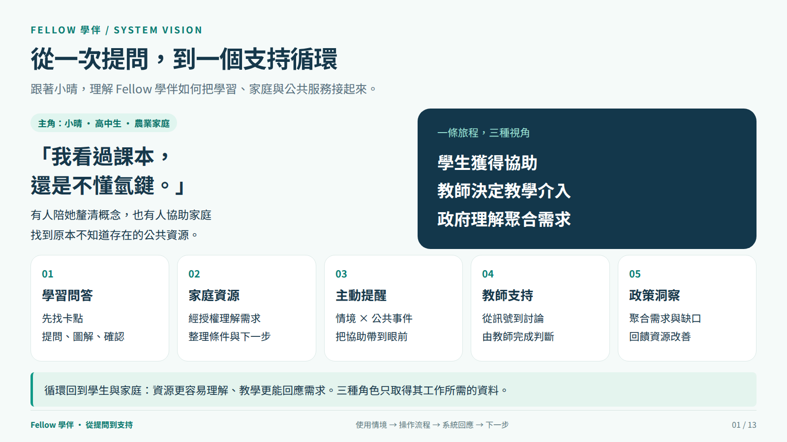

## Project Overview｜一份可跟著操作的產品故事

學伴以學生為起點，連結三種角色：學生與家庭取得學習及生活協助；教師查看授權教學摘要並決定如何介入；政府工作台查看匿名需求聚合，理解資源是否觸及需要的人。

這份 README 可直接作為 GitHub 導覽，也可依五個功能章節逐段講解。每一章都回答同一組問題：**誰遇到什麼困難？系統何時介入？使用者怎麼操作？畫面如何回應？下一步帶來什麼價值？**

| 閱讀方式 | 建議路線 |
| --- | --- |
| 先用 3 分鐘理解 | 看封面旅程、五功能導覽與各章圖片 |
| 跟著案例展示 | 依序閱讀 [學習](#feature-learning) → [資源](#feature-resources) → [提醒](#feature-notifications) → [教師](#feature-teacher) → [政府](#feature-government) |
| 比較角色與資料邊界 | [三角色流程](#role-journeys) → [隱私與資料保護](#privacy) → [匿名聚合指標](#anonymous-insights) |
| 準備簡報與後續開發 | [完整支持旅程](#end-to-end) → [系統架構](#architecture) → [未來發展](#future-development) → [展示素材](#presentation-assets) |
| 親手操作或審查技術 | 參考各章操作入口，再到文末 [技術文件導覽](#技術文件導覽) 與 [HTML／PDF 教學](#功能說明補充) |

## Why This Matters｜需要協助的人，常常不知道從哪裡開始

| 真實世界的阻力 | 對學生與家庭的影響 | 學伴希望補上的一步 |
| --- | --- | --- |
| 看過課本仍不理解，身邊沒有即時解說 | 把錯誤觀念帶到下一個單元 | 先找到卡點，再用提問、圖解與練習協助理解 |
| 補助分散在不同網站，資格與文件難懂 | 明明可能有協助，卻不知道要搜尋什麼 | 將需求轉成相關資源、待確認條件及行動清單 |
| 公告有申請期限，家庭忙於處理眼前困難 | 知道消息時可能已錯過申請 | 在取得授權且資訊經查核後，提醒相關事件與下一步 |
| 教師從成績才看到落差 | 問題累積後才被注意 | 提供可核對的教學訊號，協助教師提早關心 |
| 公共部門看得到公告量，未必看得到求助阻力 | 無法知道資訊在哪個環節失去作用 | 用匿名聚合趨勢提出可進一步調查的問題 |

## System Vision｜協助一路接得上，資料依用途分流

**產品願景：讓一次「我不懂」成為取得支持的入口。** 學習對話可以延伸到家庭主動提出的生活需求，但不能因此推斷或自動分享家庭隱私。每一次資料使用都應有明確目的、必要範圍與適當權限。

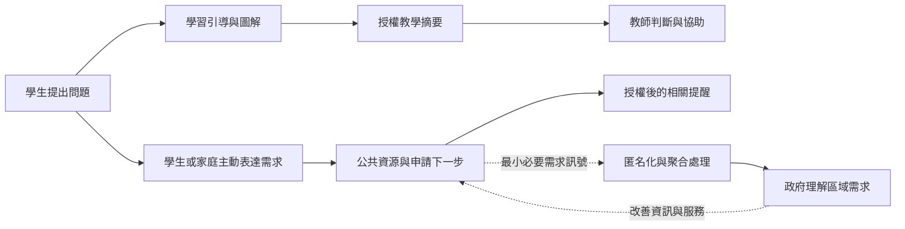
```mermaid
flowchart LR
    S[學生提出問題] --> L[學習引導與圖解]
    S --> F[學生或家庭主動表達需求]
    F --> R[公共資源與申請下一步]
    R --> N[授權後的相關提醒]
    L --> T[授權教學摘要]
    T --> H[教師判斷與協助]
    R -. 最小必要需求訊號 .-> A[匿名化與聚合處理]
    A --> G[政府理解區域需求]
    G -. 改善資訊與服務 .-> R
```

箭頭表示服務如何接續；家庭原始對話與個人資料依用途分流，不隨服務流程跨角色傳送。

| 核心功能 | 使用者操作 | 得到的支持 |
| --- | --- | --- |
| 01 學習問答與互動教學 | 提出氫鍵問題、說明想法、切換圖解並練習 | 找出卡點，依理解程度接續引導與確認 |
| 02 個人化公共資源推薦 | 自願描述家庭需求、比較資源卡與條件 | 了解可能適用的方向、推薦理由與申請下一步 |
| 03 主動通知與下一步提醒 | 選擇提醒範圍、查看相關事件與期限 | 讓重要資源及時出現，知道先確認什麼、向誰求助 |
| 04 教師端學生洞察 | 查看授權摘要、核對概念、安排教材與複習 | 更早發現需要支持的訊號，採取具體教學行動 |
| 05 政府匿名需求洞察 | 比較地區趨勢、資源缺口與流程指標 | 找到資訊阻力，作為改善政策服務的依據 |

<a id="feature-learning"></a>

## 01｜學習問答與互動教學：從「背得出名詞」到「說得出原因」

### 案例與問題：小晴分不清楚，水沸騰究竟改變了什麼

> 「課本說水分子裡有共價鍵，水分子之間又有氫鍵。既然加熱會把鍵弄斷，為什麼煮水不會煮出氫氣和氧氣？」

小晴記得名詞，卻把「一個分子內的原子連結」與「不同分子間的吸引」混在一起。再給她一遍定義，未必能看出她到底卡在哪裡。這個情境需要先聽見她的推理，再決定下一個問題。

### 系統如何介入：先讓學生表達，再決定教學方式

在這段 **蘇格拉底式互動教學** 中，AI 先提出短問題，依學生的回答判斷需要補哪一層概念；答對時增加解釋與應用，答錯時縮小問題並換圖解。

| 步驟 | 學生做什麼 | 系統如何回應 | 接下來觀察什麼 |
| --- | --- | --- | --- |
| 1 提出卡點 | 說出「氫鍵是不是 O–H 那條線？」 | 先請學生指出一個水分子內有哪些原子 | 是否能區分分子與原子 |
| 2 了解當下想法 | 描述自己認為的連結方式 | 用學生剛說的理由形成暫時教學判斷 | 哪個概念需要補充，而非替學生定級 |
| 3 引導推理 | 回答圖中實線與虛線連到哪裡 | 一次只追問一個關係，先不直接揭露整題答案 | 是否能辨別分子內、分子間 |
| 4 根據回答調整 | 答錯、猶豫，或提出正確理由 | 答錯時縮小範圍；答對時進一步問沸騰的變化 | 提示是否足夠、是否需要換方法 |
| 5 換說法與圖解 | 切換兩種視圖，對照生活類比 | 顯示 O–H 實線、分子間虛線，說明類比的限度 | 能否把圖與文字連起來 |
| 6 確認理解 | 回答新的小問題並說理由 | 核對理由；仍混淆就回到對應卡點 | 當次理解的證據與後續複習需求 |

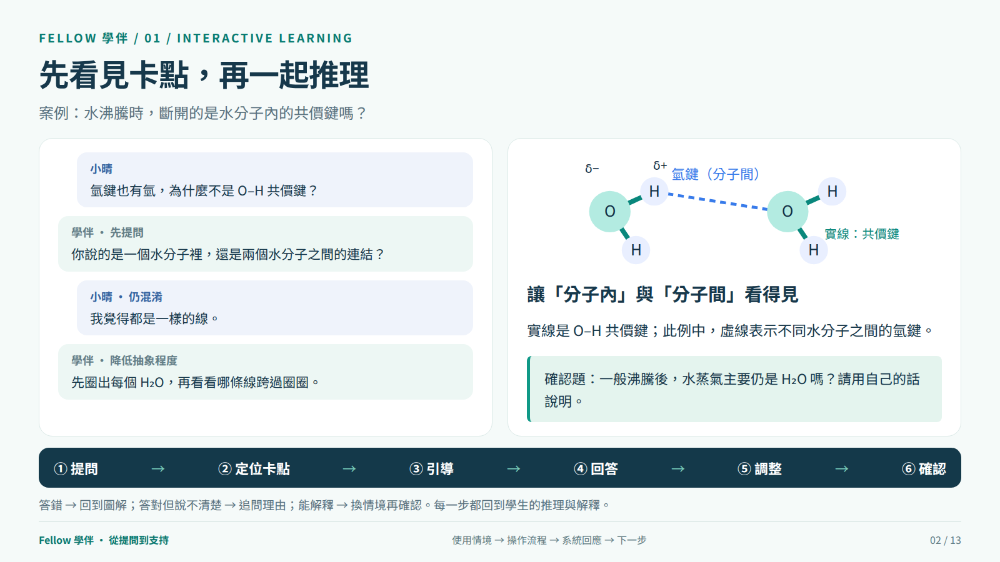

### 八回合教學示例：答錯時，也有下一條路

**回合 1｜先定位卡點**

小晴：「氫鍵和共價鍵到底差在哪裡？我看不懂水沸騰那一段。」

學伴：「我們先看一個 H₂O。你認為氧和兩個氫是同一個分子裡的原子，還是三個分子？」

**回合 2｜聽見學生的原有想法**

小晴：「是同一個分子裡的原子，但 O–H 有氫，所以那條就是氫鍵吧？」

學伴：「你已經分得出一個水分子。接下來先不看名稱：圖上的 O–H 實線連在同一個水分子內，還是跨到旁邊的水分子？」

**回合 3｜發現答錯，降低問題複雜度**

小晴：「應該跨到旁邊吧？都是連著的，我還是分不出來。」

學伴：「先把旁邊的水分子藏起來，只留下這一組 O 和兩個 H。現在這兩條實線，有沒有連出這一組以外？」

**回合 4｜用已回答的線索補上名稱**

小晴：「沒有，兩條線都在這一組裡面。」

學伴：「對，水分子內的 O–H 實線表示共價鍵，涉及原子共享電子對。現在把第二個水分子放回來：虛線從第一個分子的 H 連到另一個分子的 O，這條線跨過了幾個水分子？」

**回合 5｜換生活類比，再回到圖中**

小晴：「兩個。但我還是很難記住它們怎麼分開。」

學伴：「把每個水分子想成一小組牽著手的人。不同小組彼此散開，不等於每一組內部鬆手。這個比喻只幫你區分『組內』與『組間』，不代表真實電子、鍵能或分子運動。回到圖上，組與組之間對應實線還是虛線？」

**回合 6｜回答正確，增加一層推理**

小晴：「虛線，所以這裡的氫鍵是在不同水分子之間。」

學伴：「在這個水的例子裡，是的。一般沸騰主要克服水分子間的吸引作用，包括氫鍵。照這個線索，分子進入氣相後，會仍是 H₂O，還是變成 H₂ 和 O₂？請說理由。」

**回合 7｜用理由確認，保留錯誤分支**

小晴：「仍是 H₂O，因為分子彼此分開，分子裡的 O–H 沒有因此被拆掉。」

學伴：「這個理由能區分相態改變與分解反應。若你剛才選 H₂ 和 O₂，我們會先回到只看一個水分子的圖，重新確認保留的是哪一條連結。」

**回合 8｜換一個小問題，檢查能否轉用概念**

學伴：「水蒸氣遇冷凝結為液態水時，需要先把氫氣和氧氣重新合成嗎？用一句話說明。」

小晴：「不需要，水蒸氣主要仍是 H₂O；凝結改變相態，水分子間的作用與排列改變。」

學伴：「你這次能用分子是否保留來解釋了。下次可再用不同例題確認；如果之後仍混淆，我們就回到分子內與分子間的圖。」

**化學閱讀提示：** 這裡以水比較分子內 O–H 共價鍵與分子間氫鍵，不把「有氫的鍵」都叫氫鍵，也不把所有氫鍵都限定在分子間；合適分子的內部也可能形成氫鍵。液態水中的氫鍵持續形成與斷開，圖上的虛線只是結構示意。一般沸騰是相變，與電解水的化學反應不同。相關原創教材見 [化學鍵與氫鍵資料](../../frontend/src/data/learningScenarios.ts)。

### Conversation Flow｜學生的回答決定下一個教學動作

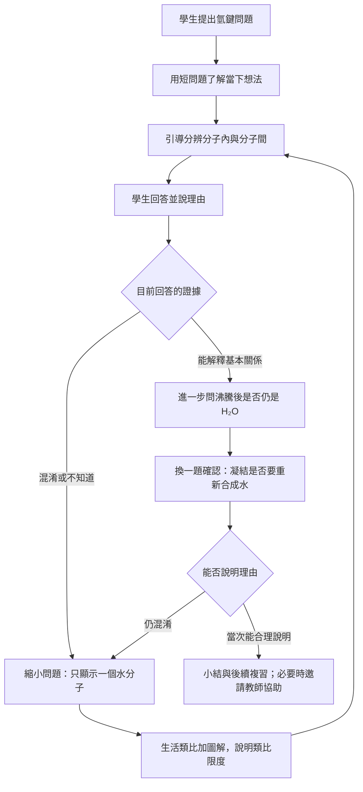
```mermaid
flowchart TD
    Q[學生提出氫鍵問題] --> D[用短問題了解當下想法]
    D --> G[引導分辨分子內與分子間]
    G --> S[學生回答並說理由]
    S --> J{目前回答的證據}
    J -->|混淆或不知道| E[縮小問題：只顯示一個水分子]
    E --> V[生活類比加圖解，說明類比限度]
    V --> G
    J -->|能解釋基本關係| A[進一步問沸騰後是否仍是 H₂O]
    A --> C[換一題確認：凝結是否要重新合成水]
    C --> R{能否說明理由}
    R -->|仍混淆| E
    R -->|當次能合理說明| F[小結與後續複習；必要時邀請教師協助]
```

一次答對提供當次理解的線索，後續仍需用新題目確認。重複卡住時，學生可以暫停、換教材或找教師協助。

### 操作教學：跟著畫面完成一次體驗

先依 [安裝與執行](../../README.md#安裝與執行) 啟動服務，再以學生角色開啟 [化學鍵與氫鍵](http://localhost:45465/learning-chat.html?topic=bonding)。完整啟動步驟與版本對照見文末技術附錄。

| 操作 | 畫面回應 | 展示時可以說 |
| --- | --- | --- |
| 1 選「化學鍵與氫鍵」，或輸入「為什麼水沸騰不會變成氫氣、氧氣？」 | 該主題的摘要、分段解釋與引用 | 「先把一個抽象問題整理成可讀的學習步驟。」 |
| 2 點開教材引用 | 原創教材片段 | 「讀者可以核對這段解釋依據哪個教材內容。」 |
| 3 在互動動畫切換「分子內：共價鍵／分子間：氫鍵」 | 水分子 O–H 實線與分子間虛線的不同位置 | 「用同一張圖比較兩種作用，讓名稱有對應位置。」 |
| 4 點「再解釋一次」 | 牽手小組類比 | 「學生可以主動換一種說法閱讀。」 |
| 5 點「我想試試」並選答案 | 正誤回饋、正確答案與解釋 | 「學生先看回饋，再說明自己的理由。」 |
| 6 點建議追問，之後重新開啟對話 | 對應的追問回答，以及保存的對話和來源 | 「可以接著問，也能回來複習同一次提問。」 |

| 分子內共價鍵 | 分子間氫鍵 |
| --- | --- |
| 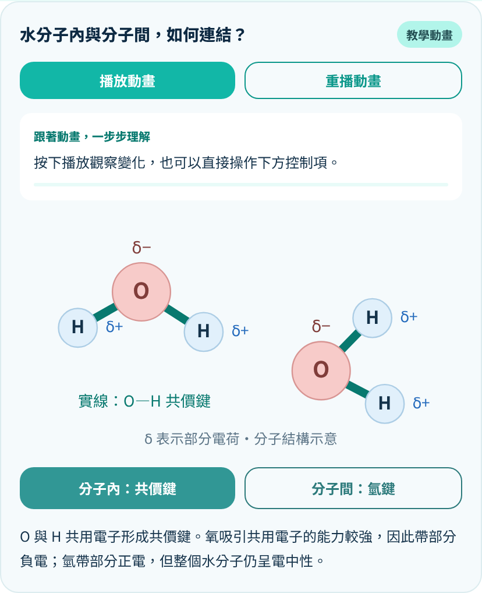 | 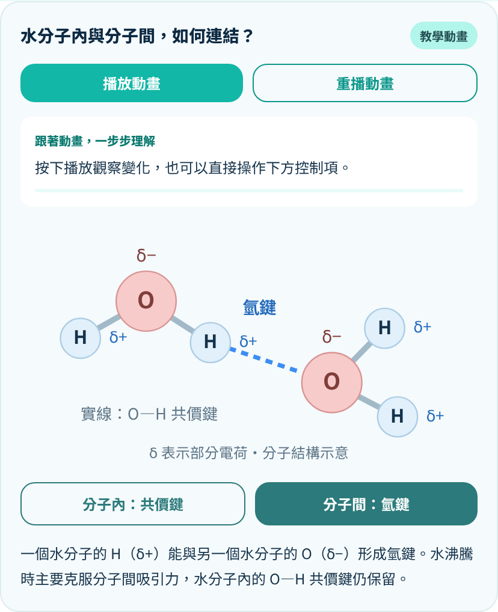 |

*同一動畫切換前後：左側看分子內的 O–H 實線，右側看跨分子的氫鍵虛線。*

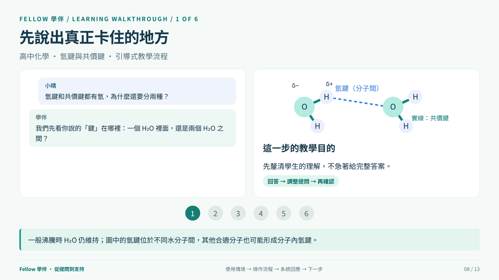

無法播放 GIF 時，可改看上方 [六步 PNG](assets/story/learning-steps.png) 與文字流程。

### 最終價值

小晴逐步說出「為什麼」，也能在不懂時選擇另一條學習路徑。提問、教材依據、可操作圖解與確認理解共同構成教學過程，讓學生把名詞連到圖形，再轉用到新問題。

**理解確認：** 答案正確之外，還要聽學生說出理由。教師可透過不同題目與後續觀察，確認這次理解能否延續。

**故事的下一步：** 小晴逐漸釐清化學概念後，也想知道家庭收入不穩定時，學費與日常支出有哪些求助方向。學伴的下一段協助，從她願意表達的需求開始。

<a id="feature-resources"></a>

## 02｜個人化公共資源推薦：把「不知道能問誰」變成可採取的下一步

### 案例與問題：氫鍵問懂了，明天的學費仍讓小晴擔心

小晴的家庭從事農業，近期收入下降。她知道家裡正在節省開支，卻不知道學費、午餐費能不能尋求協助，也不知道「助學」「急難」「社福」應該先問哪一個窗口。

> 小晴：「家裡最近收入變少，學費和午餐費有點困難。我不知道有沒有可以問的地方。」

這個需求由小晴**主動提出**。系統不能因為她氫鍵答錯、提問頻繁或學習速度較慢，就推斷家庭經濟困難、健康狀態或需要社福服務。

### 系統如何介入：先問最少的問題，再整理候選方向

學伴先說明用途，再用少量追問找出下一步所需資訊；收入證明、身分文件等正式申請材料，留待確認方案後由合適窗口處理。

> **學伴：**「我可以先整理就學與生活支持方向。為了找對窗口，你願意提供就讀學制、所在縣市，以及目前最急的費用項目嗎？不知道或不想提供的可以先跳過。」<br>
> **小晴：**「我是高中生，住在甲縣。午餐和這學期的學費最急，家裡務農。」<br>
> **學伴：**「我會先整理校內就學協助，再列出生活支持窗口。目前還不知道各項方案的條件與受理期間，所以只能標示『待確認』。」<br>
> **學伴：**「你也可以選擇是否讓我記住『家庭從事農業』，方便下次整理相關資源；這次查詢與長期記憶是不同用途。」

資源清單先提供求助方向；資格、文件與受理期限依選定方案及承辦窗口確認。

### Step-by-Step｜從生活困難走到一份可詢問的清單

| 步驟 | 小晴與家庭的操作 | 系統如何回應 | 畫面上的成果 |
| --- | --- | --- | --- |
| 1 說出情境 | 描述收入變動與學費、午餐壓力 | 先整理使用者表達的需求，說明需要哪些資訊及用途 | 「優先需求：就學費用、基本生活」 |
| 2 補充必要資訊 | 自願提供學制、概略地區及急迫事項，可跳過未知項目 | 將已知與待確認條件分開，不要求先交完整家庭文件 | 「已知：高中在學；待確認：適用方案與時程」 |
| 3 比對資源 | 查看不同方向，也可自行切換分類 | 比對需求、地區與已提供的條件，保留可能相關項目 | 可比較的候選資源與推薦理由 |
| 4 決定優先順序 | 確認目前想先處理哪一項困難 | 按需求急迫性、資訊可信度、條件相關性與已核實期限安排順序 | 「先問校內窗口；並行了解基本生活支持」 |
| 5 讀懂資源卡 | 查看理由、缺少條件、文件與來源 | 用簡單語言解釋，未知期限明示「待查核」 | 每張卡都有「為什麼看到它」與「還要確認什麼」 |
| 6 採取下一步 | 帶著問題洽詢學校或地方服務窗口 | 提供可照讀的詢問句與準備清單 | 從「不知道要搜尋什麼」走到一次具體求助 |

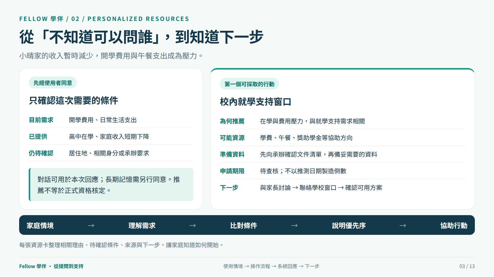

### 候選資源比較：讓家庭知道還有哪些方向可以問

| 候選方向 | 為什麼可能相關 | 必須進一步確認 | 可先詢問的下一步 |
| --- | --- | --- | --- |
| 學費補助或減免 | 小晴主動提出本學期學費壓力 | 學制、方案條件、校內受理方式與期限 | 向校內助學窗口說明繳費困難，詢問可用方案 |
| 午餐補助 | 已表達上學期間餐費需求 | 學校是否有適用協助、辦理條件及時程 | 向學校確認餐費協助窗口與需要的資料 |
| 弱勢學生補助 | 就學支出與家庭收入變動同時發生 | 各方案的家庭條件、文件及是否可併用 | 請校內承辦人員協助辨識適用項目 |
| 獎助學金 | 希望降低後續就學負擔 | 不同項目的成績、身分或其他條件及截止日 | 查看學校整理的公告，再核對各項規定 |
| 急難救助 | 若收入下降伴隨突發變故與基本生活困難 | 事件與需求如何認定、受理地區與期限 | 向地方社福窗口說明眼前最急迫的生活需求 |
| 社福資源與家庭支持 | 單一學費方案可能無法涵蓋生活、照顧等需求 | 所在地服務、需要哪些協助及轉介方式 | 請社福窗口先協助整理需求，不必自行判定方案 |
| 心理或家庭支持服務 | 僅在小晴或家庭主動表達想談談、尋求支持時列入 | 服務方式、預約、費用與資訊分享範圍 | 自願詢問學校輔導或合適支持窗口，不據此作診斷 |

各方案可能有不同條件與受理方式。家庭可以先列出眼前最急的需求，請合適窗口協助確認。

### 一張資源卡：不只列名稱，也說明「怎麼開始」

> **就學費用支持｜資格待確認**<br>
> **為什麼推薦：** 你表示目前高中在學，且本學期學費有壓力。<br>
> **可能提供的協助：** 請校內窗口協助確認助學、減免等方向。<br>
> **還缺哪些條件：** 學校現行方案、適用條件與校內辦理方式。<br>
> **可先整理：** 在學資訊與繳費單；家庭經濟資料是否需要、要哪一種，先向承辦人確認。<br>
> **申請期限：** 待查核；先確認有效公告與受理期間。<br>
> **來源與更新時間：** 待查核官方公告、來源連結與更新日期。<br>
> **下一步：** 向校內助學窗口詢問：「家裡近期收入下降，學費與午餐費有困難，能否協助確認本學期有哪些支持及辦理時間？」

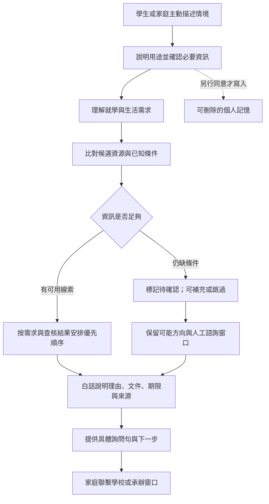
```mermaid
flowchart TD
    F[學生或家庭主動描述情境] --> U[說明用途並確認必要資訊]
    U --> C[理解就學與生活需求]
    C --> M[比對候選資源與已知條件]
    M --> I{資訊是否足夠}
    I -->|仍缺條件| Q[標記待確認；可補充或跳過]
    Q --> P[保留可能方向與人工諮詢窗口]
    I -->|有可用線索| R[按需求與查核結果安排優先順序]
    R --> E[白話說明理由、文件、期限與來源]
    P --> E
    E --> N[提供具體詢問句與下一步]
    N --> H[家庭聯繫學校或承辦窗口]
    U -. 另行同意才寫入 .-> S[可刪除的個人記憶]
```

### 操作教學：把資源卡打開給觀眾看

啟動服務後，以學生角色開啟 [就學資源諮詢](http://localhost:45465/resource-chat.html?category=education)，也可從 [公共資源列表](http://localhost:45465/resources.html) 進入。

| 操作 | 畫面回應與下一步 |
| --- | --- |
| 1 進入「就學」分類並提問學費需求 | 顯示資源卡、初步比對重點與待確認項目 |
| 2 點「查看需要什麼資料」 | 打開可勾選清單；勾選完成只是當頁確認，不等於已送件或官方收件 |
| 3 點「查看政府來源」 | 查看來源片段與可複製查詢文字；確認公告來源、更新時間與受理期限 |
| 4 點建議追問，了解窗口、文件或期限 | 取得追問回答；未知期限提醒向窗口查核 |
| 5 切換「經濟」或其他分類 | 查看農業、災害、就學、經濟、健康及其他六類資源方向 |
| 6 出現記憶建議時選「幫我記住」或「不用」 | 同意才寫入對應個人記憶；已儲存項目可至「我的」刪除 |

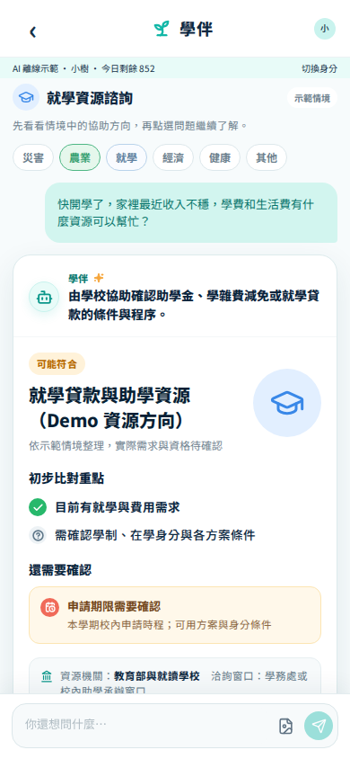

*農業與就學資源採用相同卡片結構：推薦理由、待確認條件、所需資料與下一步。*

### 最終價值：讓求助有一個清楚的入口

小晴不必先知道正式政策名稱，也能拿到一份「可能相關、仍待確認、現在可以問誰」的清單。價值在於降低尋找入口與理解公告的門檻；資源卡本身不代表核准補助、已預約服務或已完成申請。

**找不到結果時：** 可改看其他分類、調整自願提供的資訊，或帶著詢問清單洽詢學校／地方服務窗口。資料不足應標記「待確認」，不能直接判定不符合。

**記憶與對話分開管理：** 是否保存家庭特徵，由使用者選擇。刪除記憶與刪除對話是不同操作，撤回時應清楚知道處理範圍，詳見 [隱私與資料保護](#privacy)。

**故事的下一步：** 小晴選擇讓學伴記住家庭從事農業。接下來的案例中，系統另取得提醒授權，再結合與所在地和農業相關的事件資訊，把適合的資源帶到她面前。

<a id="feature-notifications"></a>

## 03｜主動通知與下一步提醒：讓資源主動找到可能需要的人

### 案例與問題：小晴還在準備化學小考，家裡已開始擔心風雨

完成氫鍵複習後，小晴回到日常課業。她在上一段資源諮詢中，自願保存「家庭從事農業」，並另外同意接收與所在地相關的資源提醒。案例中，一場颱風接近甲縣，家人忙著照顧作物，未必有時間逐一追蹤公告。

風雨過後，若家庭遭遇農損，可能需要了解農業災害救助、災後貸款或地方緊急協助。但不同方案的地區、作物、損失認定與受理期間都可能不同；知道「有補助」與知道「現在該確認什麼」之間，仍有距離。

### 系統如何介入：分清楚事件提醒與已公告的資源

系統結合使用者同意使用的資料與經查核的公開資訊，判斷可能相關的方向；「家庭務農」只是相關性線索，不能直接推定受災、符合資格或應該申請貸款。

| 時間點 | 系統取得的資訊 | 適合的回應 | 仍不能推定的事 |
| --- | --- | --- | --- |
| 颱風前 | 經查核的天氣或地方防災資訊，且涵蓋家庭自願提供的地區 | 提供有來源的防災資訊入口；註明目前尚未確認救助公告 | 不能把颱風預報說成救助已開放，也不能假設家庭一定受災 |
| 颱風後、尚無可核實公告 | 當地可能受影響，但尚缺正式方案資訊 | 顯示「救助資訊待確認」，提供可詢問的地方窗口 | 不能自行補上資格、補助額度或申請期限 |
| 災後、已有經查核公告 | 公告涵蓋的地區、對象、期間與窗口可核對 | 推薦可能相關方案，說明比對理由，再請家庭核對條件 | 公告涵蓋地區不等於每個家庭或每種作物都符合 |

### Step-by-Step｜從相關事件走到可以執行的下一步

| 步驟 | 小晴與家庭的操作 | 系統如何回應 | 產生的下一步 |
| --- | --- | --- | --- |
| 1 選擇提醒範圍 | 同意使用概略地區與務農資料，可選擇不接收 | 分開記錄資料用途與提醒偏好 | 使用者知道提醒依據，也能撤回 |
| 2 系統確認事件與來源 | 不需要先知道政策名稱 | 核對官方來源、發布與更新時間、適用地區及受理期限 | 只有可核實資訊才形成政策推薦 |
| 3 判斷是否可能相關 | 必要時自願補充作物或受影響情況，也可跳過 | 比對已知條件；未知項目保留「待確認」 | 有推薦理由與條件缺口的通知 |
| 4 閱讀通知 | 查看「為什麼提醒你」並開啟詳情 | 以六項重點整理可能方案 | 家庭能判斷是否值得進一步詢問 |
| 5 確認資格與準備事項 | 向公告所列窗口確認條件、文件與時程 | 提供可照讀的詢問句；若無法核實，保留人工求助入口 | 正式準備清單由實際方案與承辦窗口確認 |
| 6 選擇後續提醒 | 可選稍後提醒、停止此類提醒或自行記錄進度 | 只依已核實期限安排提醒；進度若由使用者回報，註明來源 | 家庭自行申請或尋求協助；系統不代為送件 |

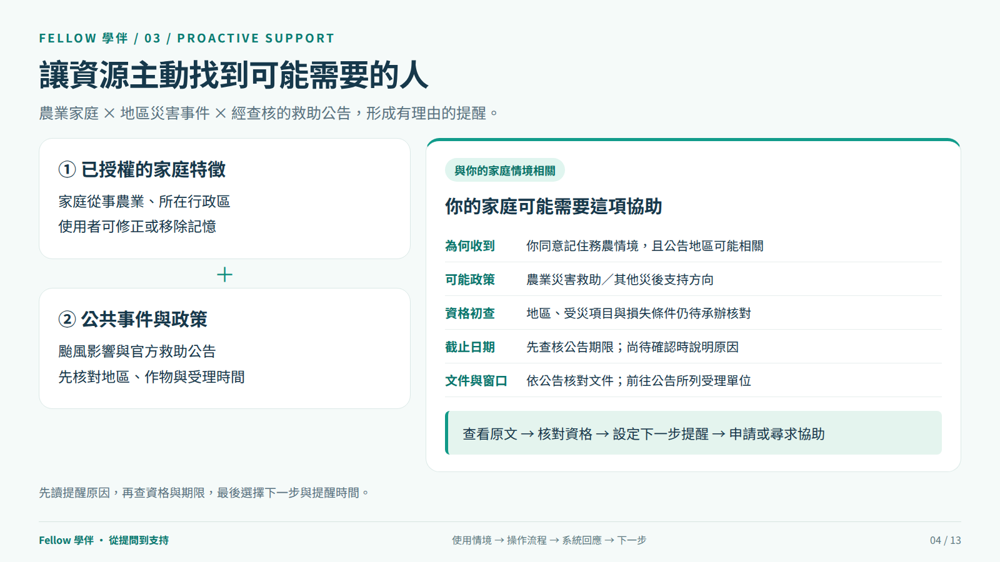

### 一則通知應回答六個問題

> **農業災害協助方向｜公告待查核**<br>
> **1. 為什麼收到：** 你曾同意使用「家庭從事農業」及「甲縣」資訊接收相關提醒；本次事件可能影響這個地區，是否受災仍需你確認。<br>
> **2. 哪項政策可能相關：** 農業災害救助；也可向窗口詢問是否另有地方緊急協助或災後貸款，條件各自確認。<br>
> **3. 申請資格：** 待確認；需核對當次公告的地區、作物、對象與損失認定方式，家庭務農不等於已符合。<br>
> **4. 截止日期：** 待查核；尚未取得有效公告，不顯示倒數，也不推定現在可申請。<br>
> **5. 準備文件：** 待公告與窗口確認；可先整理想詢問的作物、所在區域及受影響情況，是否需要身分、耕作或損失資料依實際要求辦理。<br>
> **6. 申請窗口與下一步：** 先向所在地公所詢問：「家裡務農，這次風雨後想確認有無適用的救助公告、受理時間，以及應準備哪些資料？」正式送件依公告指定窗口辦理。

取得可核實公告後，通知會補上正式名稱、來源連結、查核時間、明確期限與受理窗口。救助與貸款分開說明，家庭可依自身需求向窗口確認。

**期限提醒教學：公告資料完整時，期限如何變成行動？** 以下以政策 A 為例，D0／D10／D14 表示案例中的相對天數。實際受理期限以有效公告為準。

| 案例時間 | 已知條件 | 下一步提醒 |
| --- | --- | --- |
| D0 發布 | 政策 A 涵蓋甲縣某作物，受理至 D14；資格與指定文件已由承辦確認 | 「你提供的地區與作物可能相關；請先確認受損情況與受理條件。」 |
| D10 提醒 | 家庭選擇接收提醒，且尚未回報進度；假設公告未改版 | 「距截止日還有 4 天。可先核對文件，向指定窗口確認送件方式。」 |
| D14 截止後 | 假設未公告展延 | 停止使用原期限倒數，標示該期已截止；若有新公告，查核後重新說明 |

未回報進度可能是尚未更新狀態，提醒時先邀請家庭確認，不直接判定尚未申請。

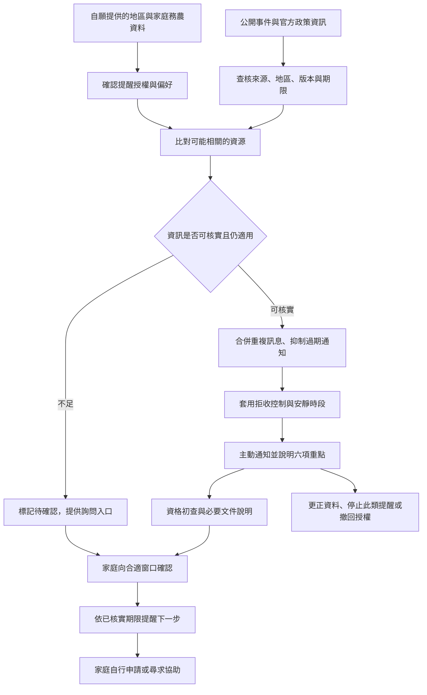
```mermaid
flowchart TD
    P[自願提供的地區與家庭務農資料] --> C[確認提醒授權與偏好]
    E[公開事件與官方政策資訊] --> V[查核來源、地區、版本與期限]
    C --> M[比對可能相關的資源]
    V --> M
    M --> K{資訊是否可核實且仍適用}
    K -->|不足| U[標記待確認，提供詢問入口]
    K -->|可核實| D[合併重複訊息、抑制過期通知]
    D --> O[套用拒收控制與安靜時段]
    O --> N[主動通知並說明六項重點]
    U --> H[家庭向合適窗口確認]
    N --> Q[資格初查與必要文件說明]
    Q --> H
    H --> R[依已核實期限提醒下一步]
    R --> A[家庭自行申請或尋求協助]
    N --> X[更正資料、停止此類提醒或撤回授權]
```

### 操作教學：查看理由，再前往資源

啟動服務後，以學生角色開啟 [通知中心](http://localhost:45465/alerts.html)，先看推薦理由，再確認條件、期限與申請窗口。

| 操作 | 畫面回應與下一步 |
| --- | --- |
| 1 查看「全部／重要／系統」分類 | 顯示符合個人資料與有效時間設定的通知，以及未讀數量 |
| 2 開啟農業通知的「查看詳情」 | 看到訊息與「為什麼提醒你」，提示向所在地公所確認當次公告 |
| 3 點「前往相關頁面」 | 標記通知已讀，前往對應資源方向，再依公告指引尋求協助 |
| 4 點「我知道了」，重新開啟通知中心 | 已讀狀態保存；已讀只代表閱讀狀態，不表示家庭接受推薦或已申請 |
| 5 在詳情點「從列表移除」 | 暫時隱藏該通知；整理列表與停止訂閱是不同操作 |

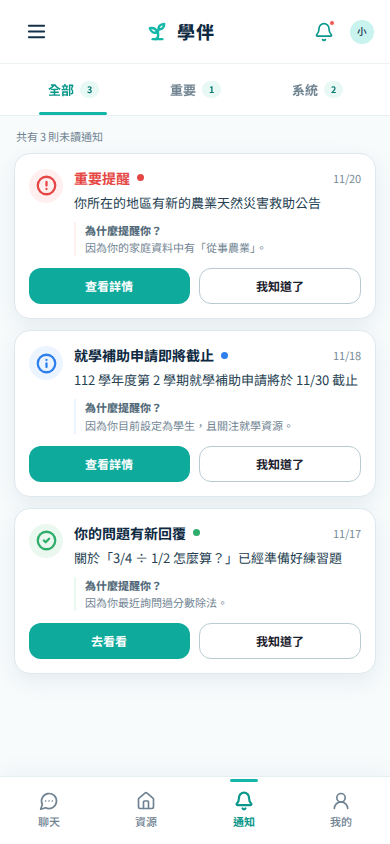

### 最終價值：讓重要資源有機會及時抵達

**把「等使用者找到資源」，改成「讓資源主動找到可能需要的人」。** 小晴不必在準備化學小考時，同時知道每一項政策名稱；一則有理由、可查核、有下一步的提醒，讓家庭多一個取得協助的入口。

**不相關或錯誤時：** 使用者應能更正資料、表達「與我無關」或停止此類提醒。來源失效或期限不明時，先停止倒數、顯示待確認，讓家庭知道還要查核哪一項資訊。

**故事的下一步：** 家庭開始有求助方向，小晴的學習也仍需要持續支持。若她之後反覆混淆氫鍵與共價鍵，教師可以在適當權限下核對教學訊號，再決定如何協助；家庭資源通知不會因此自動變成教師可見的家庭隱私。

<a id="feature-teacher"></a>

## 04｜教師端學生洞察與即時協助：在下一次考試之前，先看見可以幫忙的地方

### 案例與問題：小晴願意練習，卻又把分子內與分子間混在一起

小晴在第一次氫鍵教學中，已能說出「水沸騰後仍是 H₂O」。但隔幾天換成另一張分子圖，她又把跨分子的虛線認成 O–H 共價鍵，需要教師縮小圖的範圍後才能分辨。一次答對與換題後仍能解釋，是不同的觀察。

如果只等考試成績下降，教師可能較晚才知道她缺的是「分子內／分子間」的基礎概念。教師需要的是能核對的線索：哪個概念值得再問、哪些回答需要提示、換了什麼說法後能繼續推理；這些線索應連到教學行動。

| 發現問題的時機 | 教師取得的訊息 | 可以採取的行動 |
| --- | --- | --- |
| 常見情境：考試之後 | 分數下降，但還不知道卡在哪一步 | 再找時間回看題目、詢問學生 |
| 學習過程中 | 可追溯的概念觀察與待確認事項 | 在下一堂課或課後先確認分子內／分子間概念 |

### 系統如何介入：把訊號交給教師，也把不確定性一起交代

學伴先限定教師可查看的班級與教學用途，再整理主題摘要及建議。每個「值得關心」的提示都應能回答：資料來自何時、觀察到了什麼、還缺什麼證據，以及教師可以怎麼確認。

| 觀察層次 | 氫鍵案例中可呈現的線索 | 教師應如何解讀 |
| --- | --- | --- |
| 當次觀察 | 小晴在圖解後能說明「沸騰不會把水分子拆成氫氣、氧氣」 | 有當次理解的理由，尚不能宣告長期掌握 |
| 跨次觀察 | 不同日期、不同圖形下又混淆分子內／分子間，且保留題目與回答依據 | 值得安排基礎概念確認；不能只看同主題提問次數 |
| 提示與教法觀察 | 隱藏第二個分子後能判斷實線位置，再看雙分子圖仍需追問 | 圖形拆解「可能有幫助」，不是固定學習風格或已驗證成效 |
| 證據不足 | 只有提問紀錄，沒有實際作答、提示歷程或後續確認 | 明示「待觀察」，不能填成零分、未看完或不努力 |

### Teacher Dashboard｜四個區塊連到一個教學決定

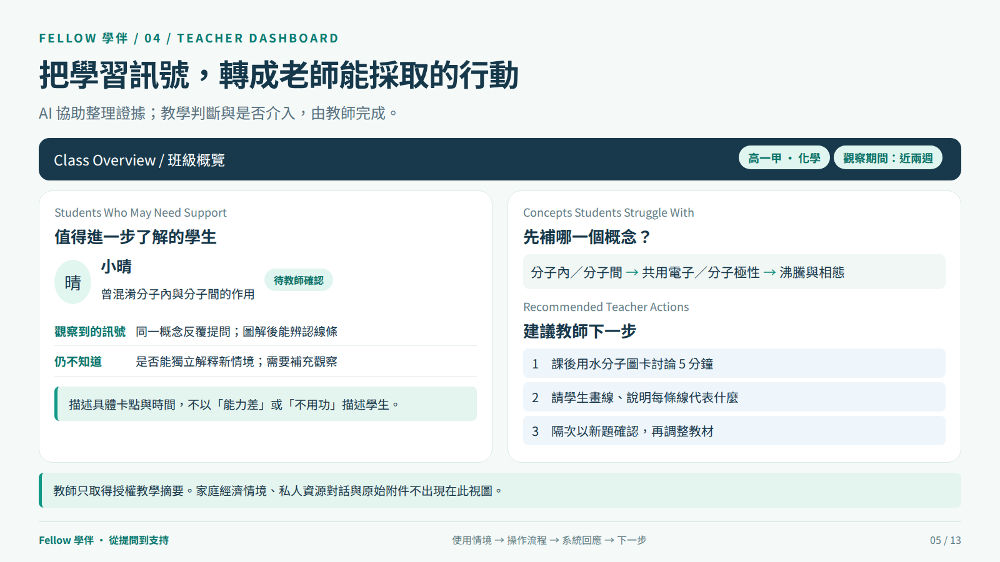

| 畫面區塊 | 展示時帶讀的內容 | 教師下一步 |
| --- | --- | --- |
| **Class Overview｜班級概況** | 班級、科目、觀察期間與資料時間；先交代範圍，再看主題分布 | 決定是否在全班補充水分子圖解 |
| **Students Who May Need Support｜可能需要支持的學生** | 小晴的化學主題值得再確認，附觀察依據及缺少證據 | 邀請簡短一對一討論，不公開排名 |
| **Concepts Students Struggle With｜待釐清的概念** | 「分子內 O–H 共價鍵」與「此水分子例中的分子間氫鍵」混淆 | 選擇對應圖解與補充教材 |
| **Recommended Teacher Actions｜建議教師行動** | 先請學生圈出一個 H₂O，再畫出跨分子虛線，最後問沸騰的改變 | 教師選擇、修改或略過建議，安排複習與再確認 |

工作台依「總覽／學生管理／學習洞察／資源協助／設定」導覽，將觀察連到教材與複習安排。

### Step-by-Step｜從看見訊號到完成一次支持

| 步驟 | 教師操作 | 系統如何協助 | 人的判斷留在哪裡 |
| --- | --- | --- | --- |
| 1 確認範圍 | 選授權班級、化學與觀察期間 | 呈現該範圍的摘要與資料時間 | 先確認是否適合拿來討論本次課程 |
| 2 找到概念 | 查看氫鍵／共價鍵主題的互動訊號 | 將主題與教材、建議問題連結 | 提問多可能是投入，也可能是卡住，需再確認 |
| 3 核對證據 | 查看學生摘要，再核對不同題目的回答與提示 | 區分當次、跨次與資料不足 | 不把單一訊號轉成能力結論 |
| 4 邀請學生說明 | 私下請小晴圈出圖中的一個水分子 | 提供可用的引導問題 | 聽小晴自己的推理，允許她更正摘要 |
| 5 選擇支持方式 | 調整題目難度、換說法、提供教材或安排課後輔導 | 開啟動畫及建立複習備註 | 教師依課堂情況選擇教法，不由系統自動分流 |
| 6 約定再確認 | 在一對一討論後，用新圖問凝結是否要重新合成水 | 記錄後續回答與觀察時間 | 能說理由才有新的理解證據；仍混淆就繼續調整 |
| 7 必要時連結支持 | 若學生主動表達其他困難，詢問是否願意尋求校內協助 | 提供適合的校內支持入口 | 依學生意願與適當程序轉介，不自動傳送家庭對話 |

### 一段師生對話：從「需要關注」回到學生怎麼想

> **教師：**「這個主題值得再一起確認。你可以先圈出圖中的一個 H₂O，再說說 O–H 實線連在哪裡嗎？」<br>
> **小晴：**「實線都在同一個水分子裡。我看到兩組放在一起就容易認錯。」<br>
> **教師：**「我們先分開看，再把第二組放回來。你畫出跨到另一個水分子的虛線，說明這裡的氫鍵位置。」<br>
> **小晴：**「虛線跨了兩個水分子。沸騰時分子彼此分開，但分子內 O–H 還在。」<br>
> **教師：**「這次說得清楚。我們下次換張圖再確認；如果還會混淆，就用課後時間慢慢拆開看。」

這次支持的成果可以是教師完成一段確認、學生知道下一步怎麼練習；不能因為教師按了「完成複習」，就宣告小晴已掌握整個單元。

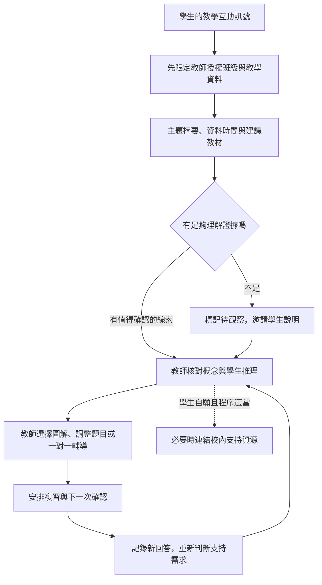
```mermaid
flowchart TD
    L[學生的教學互動訊號] --> S[先限定教師授權班級與教學資料]
    S --> D[主題摘要、資料時間與建議教材]
    D --> E{有足夠理解證據嗎}
    E -->|不足| O[標記待觀察，邀請學生說明]
    E -->|有值得確認的線索| R[教師核對概念與學生推理]
    O --> R
    R --> A[教師選擇圖解、調整題目或一對一輔導]
    A --> P[安排複習與下一次確認]
    P --> C[記錄新回答，重新判斷支持需求]
    C --> R
    R -. 學生自願且程序適當 .-> H[必要時連結校內支持資源]
```

### 操作教學：看摘要、選教材、安排複習

啟動服務後開啟 [教師工作台](http://localhost:45465/teacher.html)，選擇授權班級與化學主題。

| 操作 | 畫面回應與下一步 |
| --- | --- |
| 1 在「總覽」選班級、科目「化學」與期間 | 重新取得篩選後的摘要；後端先套用教師授權班級範圍 |
| 2 到「學習洞察」查看化學鍵主題 | 顯示主題統計、教材及建議活動，教師可依學生回答調整教法 |
| 3 到「學生管理」搜尋或點開一名學生 | 顯示該學生的提問、概念摘要及已有的觀察；無正確率紀錄時顯示「—」 |
| 4 到「資源協助」找到化學鍵與氫鍵教材並開啟動畫 | 同一分頁預覽 O–H 實線與分子間虛線；教師預覽不會建立學生對話 |
| 5 返回工作台，選「加入複習計畫」；也可從學生詳情選「安排個別複習」 | 可填「先圈出一個 H₂O，再比較跨分子虛線」作為教學備註；個別按鈕依學生主要主題安排 |
| 6 儲存後到「我的複習計畫」查看，並切換完成狀態 | 查看計畫與教學備註，標記待複習或完成；完成標記是教師的工作紀錄 |
| 7 視需要匯出 CSV | 匯出目前範圍的班級學習摘要，包含姓名等教學資料；這份 CSV 不是匿名政府資料 |

<details>
<summary>展開教師操作畫面</summary>

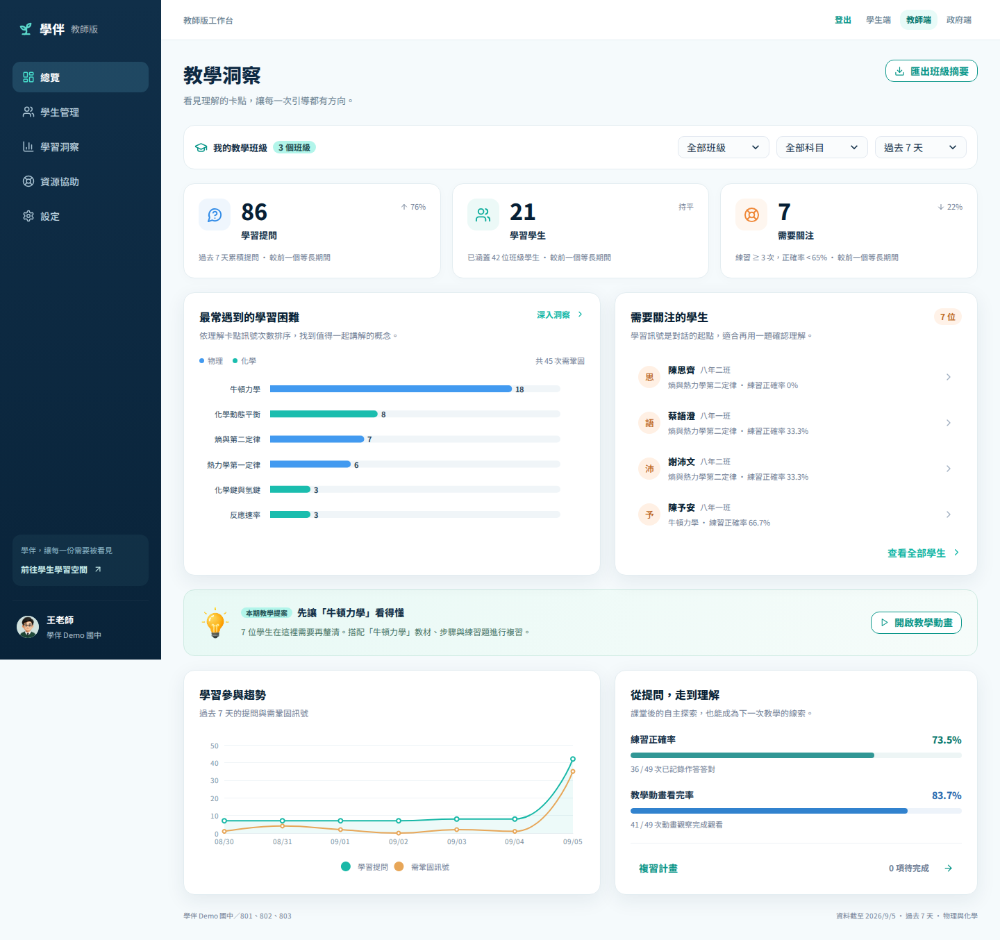

</details>

### 最終價值

**AI 幫助教師更快看到訊號，但最終的教育判斷與介入仍由教師完成。** 小晴得到的是更早的一次理解確認與適合的教學支持；教師少花時間整理零散資訊，多一個具體起點與學生對話。

**故事的下一步：** 教師協助小晴釐清氫鍵，家庭也開始找到求助方向。公共部門需要理解的是地區層級的需求與資訊阻力；下一章以匿名聚合呈現這些問題，不延伸開放教師名冊或學生個人對話。

<a id="feature-government"></a>

## 05｜政府匿名需求與政策洞察：從區域訊號，找到服務可以改善的地方

### 案例與問題：很多家庭都在找協助，承辦人看得到什麼

小晴的故事走到這裡，政府端不會出現她的姓名、氫鍵對話或家庭求助內容。公共部門需要看到的是：某個地區是否出現值得進一步了解的需求變化，以及民眾取得資訊之後，哪一步仍需要協助。

**情境 A｜農業、急難與學費的需求訊號一起增加。** 颱風之後，甲縣的甲區出現更多農業災害救助、急難協助與學費支持相關互動。範例數據中，農業救助訊號由相同長度前期的 **40 次**增加至本期 **100 次**。承辦人可以先核對災情、服務窗口詢問量與平台使用變化，再決定是否加強資源說明與服務量能。

**情境 B｜政策已公布，取得協助的過程仍不順。** 承辦人想知道：家庭是否不知道政策、看不懂文件要求，或在申請中途遇到困難。將取得資訊、開啟詳情、開始申請到確認送件串成漏斗，可協助辨識需要再調查的步驟；指標必須來自合法授權、可核對的流程資料。

**數據解讀：** 40 → 100 是範例中的互動需求訊號次數，不是受災戶、獨立家庭或申請人數。平台使用量、重複提問、季節與宣傳活動，都可能影響數字。

### 系統如何介入：把趨勢轉成可調查的問題

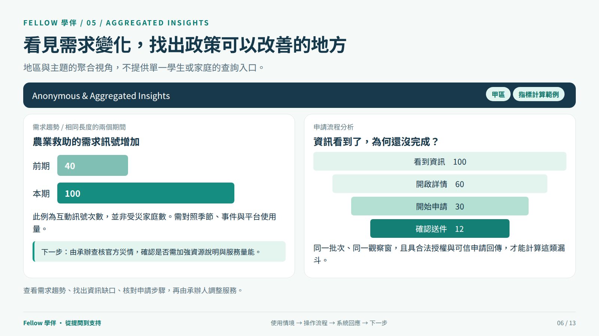

*範例數據：左側是事件次數比較；右側是另一組申請漏斗計算範例，兩者使用不同資料與分母。*

| Dashboard 區塊 | 想回答的問題 | 承辦人可採取的下一步 |
| --- | --- | --- |
| 需求趨勢 | 哪些主題的互動訊號改變了 | 對照相同長度期間、災情與平台使用量，核對變化原因 |
| 資源缺口 | 求助方向是否缺乏清楚的資訊或合適窗口 | 人工盤點可用方案、服務量能與說明文件 |
| 政策觸及率 | 符合資格的對象，有多少確實收到資訊 | 先建立合法取得的資格母體與去重觸及資料，再定義指標 |
| 申請流程流失 | 哪一個步驟尚未觀察到後續完成 | 核對資料延遲、跨管道申請與流程問題，再訪談承辦及自願參與者 |
| 地區需求變化 | 哪些地區的訊號與服務覆蓋值得再看 | 同時考慮人口、網路可及性與平台普及程度，避免只服務高使用區 |
| 政策改善建議 | 哪些資訊或服務值得調整 | 人工確認後試行白話文件、窗口指引或申請協助，再觀察結果 |

### Step-by-Step｜從聚合訊號走到一次服務改善

| 步驟 | 政府端操作 | 系統如何回應 | 判斷與行動 |
| --- | --- | --- | --- |
| 1 確認資料範圍 | 選地區、期間與需求主題 | 顯示範圍、資料時間及前期比較 | 先確認這是平台觀察資料，不能代表全體居民 |
| 2 找到變化 | 比較農業、急難與就學需求訊號 | 呈現主題與區域計數 | 把上升當成待調查線索，不直接推算受災家庭 |
| 3 查明缺口 | 查看同一範圍的資源需求與興趣訊號 | 比較聚合計數，核對觸及與申請資料的定義及完整性 | 核對方案是否存在、資訊是否易懂、窗口是否可接觸 |
| 4 提出改善假設 | 選擇「文件難懂」或「入口不易找」等待驗證問題 | 整理證據、資料缺口與候選改善方式 | 承辦人確認原因，不能由 AI 自動裁定政策失敗 |
| 5 調整服務 | 人工改寫公告、增加詢問入口或安排申請協助 | 依正式來源更新資源指引 | 由負責單位審查與發布，系統不自行變更政策 |
| 6 再觀察 | 追蹤相同定義、相同長度期間 | 查看聚合與追蹤清單 | 確認變化是否與改善有關，避免只憑前後差異宣稱成效 |

<a id="anonymous-insights"></a>

### Anonymous & Aggregated Insights｜先說清楚分子與分母

**申請漏斗計算範例：** 以同一批次、同一觀察窗內去重且可核對的資料為例：100 位看到資訊 → 60 位開啟詳情 → 30 位開始申請 → 12 位確認送件。此處使用範例數據說明指標計算。

| 想看什麼 | 計算範例 | 正確解讀 |
| --- | --- | --- |
| 開始申請後的確認送件比例 | 12 ÷ 30 = **40%** | 分母是該批次開始申請者；只描述觀察窗內確認送件的比例 |
| 尚未確認送件比例 | (30 − 12) ÷ 30 = **60%** | 可能仍在準備、回傳延遲或改走其他管道，不能稱為已放棄 |
| 正式政策觸及率 | 已確認觸及的符合資格人數 ÷ 合法取得的符合資格母體 | 必須同時具備資格母體與去重觸及資料；不是 60 ÷ 100 的替代名稱 |

**事件與人數分開看：** 同一家庭可能產生多次互動。平台事件比率描述互動紀錄，政策觸及率需要符合資格的母體，申請完成率需要可核對的申請流程；三者不能互相替代。

確認送件不等於核准，也不等於已領取補助。樣本或母體不足、前後定義不一致、來源不可核對時，應顯示「資料不足」並不顯示百分比；前期為零也應呈現筆數與限制，不使用誤導性的成長率。小群體是否可發布還要另經隱私檢查。

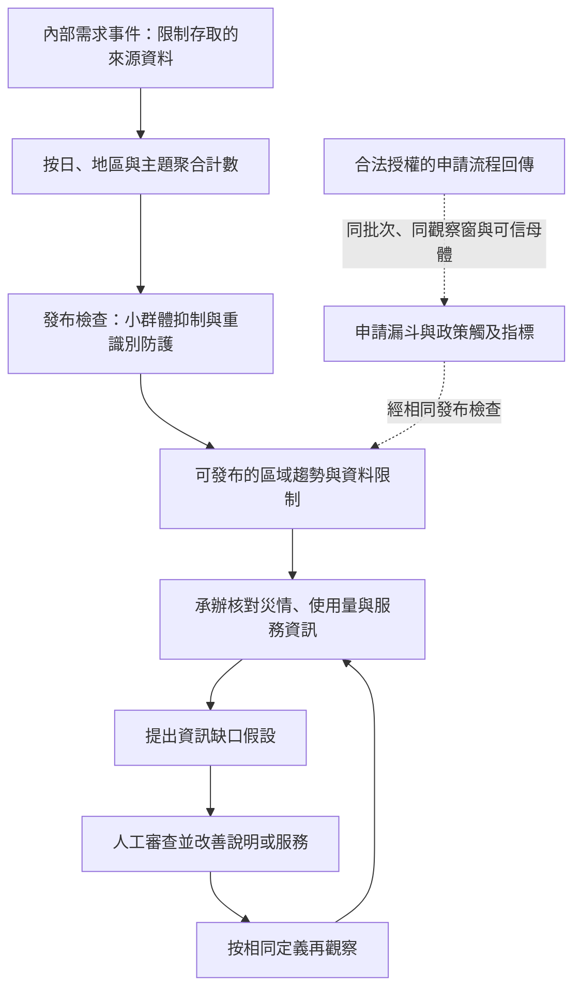
```mermaid
flowchart TD
    E[內部需求事件：限制存取的來源資料] --> A[按日、地區與主題聚合計數]
    A --> P[發布檢查：小群體抑制與重識別防護]
    P --> G[可發布的區域趨勢與資料限制]
    G --> Q[承辦核對災情、使用量與服務資訊]
    Q --> H[提出資訊缺口假設]
    H --> I[人工審查並改善說明或服務]
    I --> O[按相同定義再觀察]
    O --> Q
    F[合法授權的申請流程回傳] -. 同批次、同觀察窗與可信母體 .-> M[申請漏斗與政策觸及指標]
    M -. 經相同發布檢查 .-> G
```

### 操作教學：篩選、比較、追蹤與匯出

啟動服務後開啟 [政府工作台](http://localhost:45465/government.html)，從期間、地區與需求主題開始，比較相同範圍的趨勢。

| 操作 | 畫面回應與下一步 |
| --- | --- |
| 1 選期間與地區 | 重新取得範圍內的主題、地區與趨勢聚合；可看資料期間與前期比較 |
| 2 開啟需求主題或地區詳情 | 依地區與主題取得聚合，無法開啟某位學生或家庭 |
| 3 查看「教育需求／資源銜接／地區分析」 | 對照既有事件指標；解讀時使用上節分子、分母與限制 |
| 4 在詳情點「加入追蹤」 | 將地區與主題組合加入追蹤清單，方便下次回來比較 |
| 5 點「匯出彙整」 | 匯出目前期間的區域、主題及事件計數 CSV，不含姓名、學生 ID 或原始對話 |

<details>
<summary>展開政府操作畫面</summary>

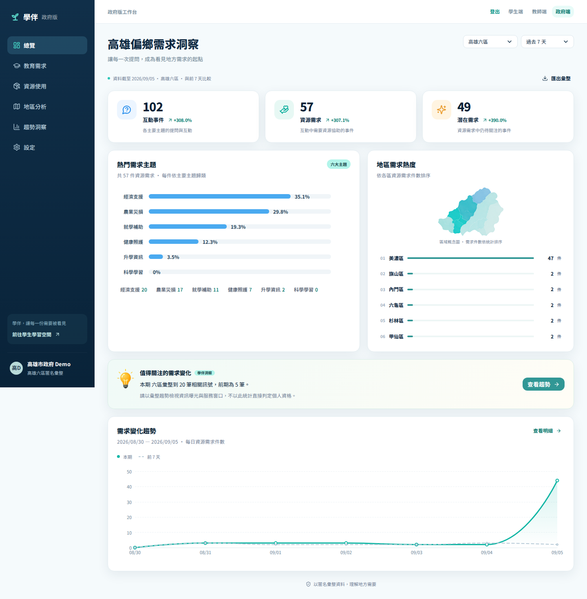

</details>

### 最終價值

公共部門可以更早得到一個值得查證的問題：「這個區域的農業協助資訊是否需要更清楚、更容易取得？」改善可以從公告用語、服務入口或申請協助開始，再回到家庭實際能採取的下一步。

<a id="role-journeys"></a>

## Student / Teacher / Government｜三種角色，各自完成哪一步

| 角色 | 入口與操作路線 | 得到的成果 | 由誰完成下一步 |
| --- | --- | --- | --- |
| 學生／家庭 | 氫鍵提問 → 切換圖解 → 練習與追問 → 主動提出資源需求 → 查看通知與條件 | 能複習的學習內容，以及可詢問窗口的資源清單 | 學生說明理解；家庭確認資格並自行尋求協助 |
| 教師 | 授權班級 → 化學主題摘要 → 核對學生想法 → 開啟氫鍵教材 → 安排複習 | 一次具體教學支持與下次確認的安排 | 教師選擇教法、與學生討論並判斷是否需進一步支持 |
| 政府 | 地區／期間 → 聚合趨勢 → 主題詳情 → 核對資料限制 → 追蹤或匯出 | 值得調查的區域需求與資訊缺口 | 承辦人查證、審查改善方案並追蹤結果 |

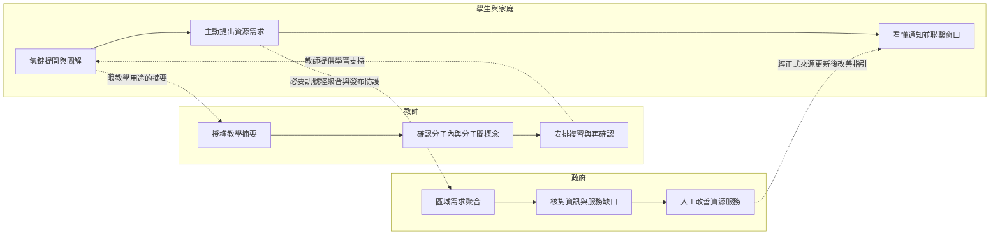
```mermaid
flowchart LR
    subgraph Student[學生與家庭]
        S1[氫鍵提問與圖解] --> S2[主動提出資源需求]
        S2 --> S3[看懂通知並聯繫窗口]
    end
    subgraph Teacher[教師]
        T1[授權教學摘要] --> T2[確認分子內與分子間概念]
        T2 --> T3[安排複習與再確認]
    end
    subgraph Government[政府]
        G1[區域需求聚合] --> G2[核對資訊與服務缺口]
        G2 --> G3[人工改善資源服務]
    end
    S1 -. 限教學用途的摘要 .-> T1
    S2 -. 必要訊號經聚合與發布防護 .-> G1
    T3 -. 教師提供學習支持 .-> S1
    G3 -. 經正式來源更新後改善指引 .-> S3
```

角色之間只銜接必要的支持資訊，家庭私聊不直接送往教師或政府。

<a id="privacy"></a>

## Privacy & Data Protection｜使用者應知道誰看得到什麼

小晴可以取得氫鍵教學，也可以選擇是否保存家庭務農資料。她同意一項記憶，不代表已同意教師查看家庭對話、接收所有通知，或把所有內容轉作政策分析。產品需要把這些用途分別說清楚。

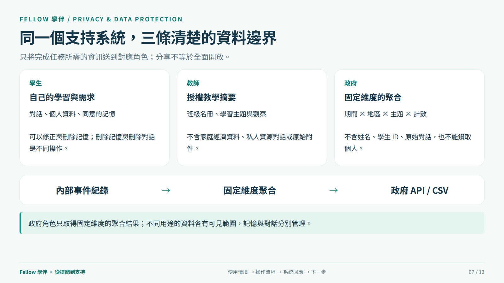

以下矩陣說明三種角色的資料可見範圍。教師需要教學摘要，政府需要區域趨勢，兩者各有明確用途。

| 資料 | 學生本人 | 教師角色 | 政府角色 |
| --- | --- | --- | --- |
| 自己的學習及資源對話、引用 | 可查看自己的紀錄 | 只取得授權教學提問與摘要，不含家庭資源原始對話 | 不提供 |
| 上傳圖片 | 本人驗證後可下載 | 不提供學生原始附件 | 不提供 |
| 家庭特徵與同意的個人記憶 | 可查看、修改個人資料並刪除記憶 | 不提供家庭經濟資料或私人記憶 | 不提供 |
| 學生姓名、班級與教學摘要 | 可查看自己的個人學習內容 | 限授權班級；CSV 含姓名等教學資料 | 不提供名冊、姓名或學生 ID |
| 日期／地區／主題的聚合計數 | 不是學生端工作台功能 | 不是政府聚合的替代入口 | 可篩選、查看與匯出，不能鑽取個人 |

### 使用者控制：每一種用途，都說明清楚

| 控制項目 | 使用者需要理解的事 | 服務應交代的內容 |
| --- | --- | --- |
| 是否保存記憶 | 這次查詢與長期保存家庭特徵是不同用途 | 保存什麼、用在哪裡，以及如何拒絕或刪除 |
| 更正與撤回 | 資料可以更正；同意的範圍可以重新選擇 | 撤回影響哪些後續推薦、提醒與資料處理 |
| 刪除資料 | 刪除記憶、對話與附件各有不同範圍 | 已處理項目、保存期限、備份與已發布聚合的處理方式 |
| 教師存取 | 教師只查看授權班級的教學資料 | 誰可存取、為何存取、匯出後如何保管 |
| 政府聚合發布 | 政府取得區域趨勢，不能鑽取個人 | 小群體、敏感組合與重複查詢的發布檢查 |

**匿名化不只移除姓名。** 小地區、少數事件與多次篩選仍可能讓人推測個別情況。發布前須依資料風險檢查最小群體、時間與地區粒度，必要時合併或不顯示結果，也要限制跨次查詢可推算出的差異。

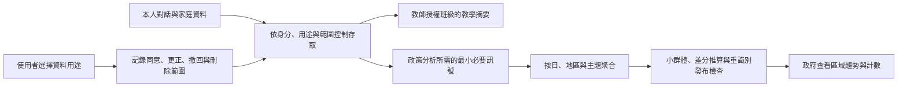
```mermaid
flowchart LR
    P[本人對話與家庭資料] --> S[依身分、用途與範圍控制存取]
    S --> T[教師授權班級的教學摘要]
    S --> E[政策分析所需的最小必要訊號]
    E --> A[按日、地區與主題聚合]
    A --> R[小群體、差分推算與重識別發布檢查]
    R --> G[政府查看區域趨勢與計數]
    C[使用者選擇資料用途] --> D[記錄同意、更正、撤回與刪除範圍]
    D --> S
```

<a id="end-to-end"></a>

## End-to-End User Journey｜支持最後回到小晴的日常

| 故事節點 | 小晴與周圍的人經歷了什麼 | 可展示的產出 |
| --- | --- | --- |
| 一個晚上 | 小晴問「氫鍵是不是 O–H 那條線」，從單一水分子看起 | 圖解、追問與對凝結的新解釋 |
| 另一次主動求助 | 她說出學費與午餐壓力，選擇是否提供或記住家庭資料 | 候選資源、待確認條件與可照讀的詢問句 |
| 一次相關事件 | 經授權與公告查核後，家庭收到農業協助提醒 | 推薦理由、期限及聯繫窗口的下一步 |
| 一次教學支持 | 教師核對她分子內／分子間的混淆，安排圖解與再確認 | 具體複習備註；學習成效仍需觀察 |
| 一次服務改善 | 承辦從區域聚合提出疑問，核查後改善資源說明 | 家庭更容易找到、讀懂與使用的服務入口 |

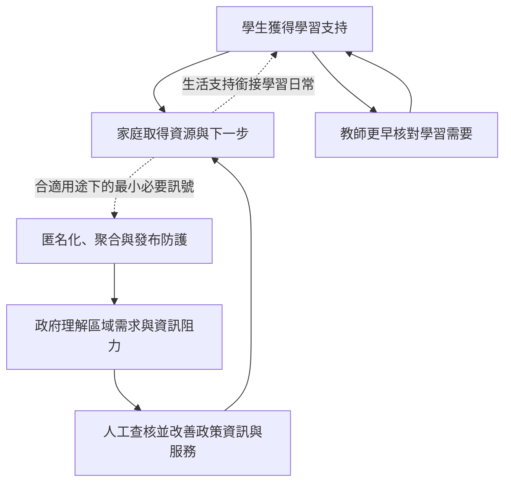
```mermaid
flowchart TD
    L[學生獲得學習支持] --> F[家庭取得資源與下一步]
    L --> T[教師更早核對學習需要]
    T --> L
    F -. 合適用途下的最小必要訊號 .-> A[匿名化、聚合與發布防護]
    A --> G[政府理解區域需求與資訊阻力]
    G --> P[人工查核並改善政策資訊與服務]
    P --> F
    F -. 生活支持銜接學習日常 .-> L
```

教師提供教學支持、家庭決定是否求助，政府改善資源服務。這個循環讓學習與生活上的支持接續下去，三種角色各自保有判斷與資料邊界。

<a id="architecture"></a>

## Overall System Architecture｜同一個系統，依用途產生不同回應

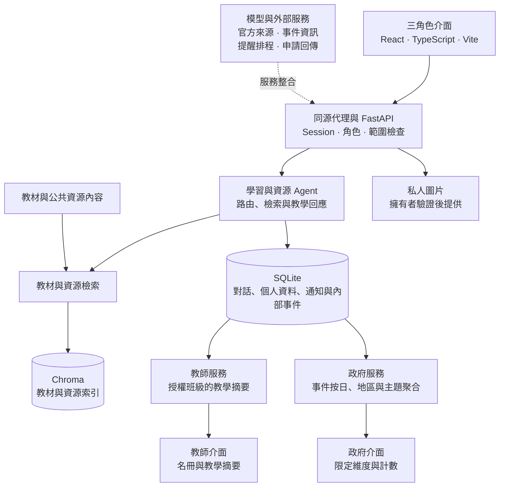
```mermaid
flowchart TD
    W[三角色介面<br/>React · TypeScript · Vite] --> API[同源代理與 FastAPI<br/>Session · 角色 · 範圍檢查]
    API --> AG[學習與資源 Agent<br/>路由、檢索與教學回應]
    AG --> R[教材與資源檢索]
    R --> C[(Chroma<br/>教材與資源索引)]
    J[教材與公共資源內容] --> R
    AG --> DB[(SQLite<br/>對話、個人資料、通知與內部事件)]
    API --> IMG[私人圖片<br/>擁有者驗證後提供]
    DB --> TS[教師服務<br/>授權班級的教學摘要]
    DB --> GS[政府服務<br/>事件按日、地區與主題聚合]
    TS --> TO[教師介面<br/>名冊與教學摘要]
    GS --> GO[政府介面<br/>限定維度與計數]
    F[模型與外部服務<br/>官方來源 · 事件資訊<br/>提醒排程 · 申請回傳] -. 服務整合 .-> API
```

三種角色共用服務入口，依身分、範圍與用途取得不同回應。教材與資源檢索支援學生提問；教師服務提供授權教學摘要；政府服務提供限定維度的聚合結果。外部模型、官方來源與事件資訊透過服務介面整合，元件版本詳見文末對照。

<a id="future-development"></a>

## Future Development｜先讓資料與教學可信，再擴大協助範圍

| 階段與優先序 | 要完成的能力 | 如何確認可以往下走 |
| --- | --- | --- |
| P0 正式使用前的資料基礎 | 正式身分、角色授權、跨用途選擇、保存與刪除、小群體與重識別防護 | 用越權、撤回、刪除與重複篩選案例驗證，明確記錄失敗處理與發布限制 |
| P1 可評估的互動教學 | 接入生成模型、氫鍵動態追問、可信教材來源、作答與提示紀錄 | 由教師檢查化學正確性與引導品質；以不同題型及錯誤回答驗證調整與理解確認 |
| P2 可查核的資源與提醒 | 官方來源版本、資格缺口、期限、通知偏好、排程與更正 | 用公告變更、過期、來源中斷、不相關及拒收情境驗證，未知資訊保持待確認 |
| P3 教師支持與跨裝置協作 | 保存真實作答證據、複習同步、學生更正與介入回饋 | 確認跨裝置一致、資料不足不生成掌握結論；教師能核對並修改建議 |
| P4 政策服務評估 | 合法母體、可信申請回傳、漏斗及經防護的聚合發布 | 核對分子分母、去重、觀察窗與小群體；由承辦驗證指標能否回答服務問題 |

後續場域評估可觀察學生是否能解釋新例題、家庭是否看懂下一步、教師是否能完成有依據的支持，以及服務資訊是否更容易取得。評估應同時核對資料品質、使用者回饋與實際完成的行動。

<a id="presentation-assets"></a>

## 展示與素材使用｜把 README 當成可帶讀的投影片

建議展示順序：封面支持旅程 → 氫鍵六步圖與動畫切換 → 家庭資源卡 → 農業提醒 → 教師支持 → 政府聚合 → 資料邊界。每張圖可用「案例、卡點、系統回應、下一步」四句話帶讀；操作時依各章教學表格進行。

| 素材 | 用途與開啟方式 |
| --- | --- |
| 7 張 16:9 概念 PNG | 本文封面、五功能與資料邊界；可直接在 GitHub 顯示，點圖開啟原尺寸 |
| 6 張氫鍵逐步 PNG | [第 1 步](assets/story/learning-frame-1.png) · [第 2 步](assets/story/learning-frame-2.png) · [第 3 步](assets/story/learning-frame-3.png) · [第 4 步](assets/story/learning-frame-4.png) · [第 5 步](assets/story/learning-frame-5.png) · [第 6 步](assets/story/learning-frame-6.png)，適合逐步口頭講解 |
| [氫鍵教學 GIF](assets/story/learning-walkthrough.gif) | 6 段摘要，共 39 秒；可在 GitHub 播放，完整教學仍以正文八回合為準 |
| 2 張氫鍵操作 PNG | 本文共價鍵／氫鍵切換對照，合計新增 15 張 PNG 與 1 個 GIF |
| [手動圖卡投影片 HTML](assets/story/storyboard.html) | 共 13 張：7 張概念圖與 6 張教學步驟；用鍵盤左右鍵或選單切換，無自動播放，可替代 GIF |

**HTML 的開啟方式：** GitHub 會顯示 HTML 原始碼。完整 clone 後可在本機瀏覽器開啟投影片，保留相對路徑的字型與素材；也可啟動服務並同步文件後，開啟 [本機手動圖卡投影片](http://localhost:45465/評審請看這/assets/story/storyboard.html)。既有五份 HTML／PDF 功能教學仍保留在文末。

```bash
# 在專案根目錄更新公開文件副本；已建置的服務需重新建置或重啟才套用
node scripts/sync-judge-docs.mjs

# 重製本次概念圖、逐步圖與 GIF
node scripts/generate-readme-visuals.mjs

# 可選：另從執行中的 offline_demo 重拍兩張氫鍵切換介面
node scripts/generate-readme-visuals.mjs --capture-demo
```

重製需已安裝專案的 Playwright／Chromium、相關系統依賴與 Python Pillow；實際 Demo 擷取另需本機服務執行中。圖卡由 [素材產生腳本](../../scripts/generate-readme-visuals.mjs) 製作，公開副本由 [同步腳本](../../scripts/sync-judge-docs.mjs) 更新。動畫不便播放時，可使用靜態 PNG、文字流程或手動投影片。

## 技術文件導覽

| 主題 | 文件 | 閱讀重點 |
| --- | --- | --- |
| 系統架構 | [架構總覽](../../README.md#系統架構)／[全端設計規格](../specs/hackathon-fullstack-sdd.md) | 元件分工、技術選型與三角色資料流程 |
| 前端實作 | [前端目錄說明](../../frontend/README.md)／[前端設計規格](../specs/frontend-sdd.md) | 頁面、元件、API client 與建置方式 |
| 後端實作 | [後端目錄說明](../../backend/README.md)／[後端設計規格](../specs/backend-sdd.md) | FastAPI 服務、模型介面、檢索與資料模型 |
| API 與權限 | [API 契約](../api-alignment.md) | 請求與回應格式、session、角色授權及資料邊界 |
| 安裝與部署 | [安裝與執行](../../README.md#安裝與執行)／[部署設定](../../deploy/README.md) | 本機啟動、容器設定與 API 代理 |
| 維運與排查 | [操作手冊](../demo-runbook.md) | 環境設定、資料保存、驗證步驟與故障排查 |
| 測試與驗收 | [整合驗證紀錄](../integration-report.md) | 測試環境、當時驗收結果、重跑命令與未驗證項目 |

## 建議閱讀順序

1. 先讀架構總覽，了解前後端分工與學生、教師、政府的資料流程。
2. 依審查主題查看前後端規格與 API 契約。
3. 對照安裝步驟、操作手冊與整合驗證紀錄，確認重現方式及驗收範圍。

設計規格與 API 契約記錄設計及對接約定；目前完成範圍與限制以 [根目錄 README](../../README.md#限制與未來工作) 為準，測試結果請依整合驗證紀錄的日期與環境判讀。

## 功能說明補充

以下五份 HTML／PDF 說明功能操作與資料邊界，可搭配技術文件閱讀；PDF 可直接在 GitHub 預覽或下載。

- 01 學習問答與互動教學動畫：[HTML](01-學習問答與互動動畫.html)｜[PDF](01-學習問答與互動動畫.pdf)
- 02 個人化公共資源推薦：[HTML](02-公共資源推薦.html)｜[PDF](02-公共資源推薦.pdf)
- 03 主動通知與下一步提醒：[HTML](03-主動通知與下一步提醒.html)｜[PDF](03-主動通知與下一步提醒.pdf)
- 04 教師學習洞察與複習計畫：[HTML](04-教師學習洞察與複習計畫.html)｜[PDF](04-教師學習洞察與複習計畫.pdf)
- 05 政府匿名需求洞察：[HTML](05-政府匿名需求洞察.html)｜[PDF](05-政府匿名需求洞察.pdf)

## 技術附錄｜版本對照

<details>
<summary>展開目前可重現版本、待完成項目與實作來源</summary>

本文按完整產品旅程安排案例與教學流程；實際執行範圍以此版本對照為準。目前可重現環境為 `offline_demo`，使用原創預設回答、離線檢索及案例資料。

| 五大核心功能 | 目前 Demo 可展示 | 完整願景仍待完成或驗證 |
| --- | --- | --- |
| 01 學習問答與互動教學 | 六個理化主題、既有追問、教材引用、互動動畫與練習回饋 | 依學生作答動態調整問題與難度、持續驗證理解 |
| 02 個人化公共資源推薦 | 六類資源情境、示範資源、待確認條件、文件與下一步 | 即時官方政策更新、完整條件比對與可靠排序 |
| 03 主動通知與下一步提醒 | 示範通知、查看詳情、標記已讀 | 真實事件串接、通知排程、推播與申請期限提醒 |
| 04 教師端學生洞察 | 授權名冊與學習摘要、教材、複習安排、CSV 匯出 | 實際學習行為指標、介入回饋與成效驗證 |
| 05 政府匿名需求洞察 | 地區／期間／主題篩選、匿名需求聚合與 CSV 匯出 | 真實政策觸及與申請完成資料、正式匿名化風險評估 |

### 學習與資源

- 學習支援牛頓力學、熱力學、熵、化學平衡、化學鍵結、反應速率六個主題及既有追問。自適應追問、動態難度、跨次理解驗證與教法效果比較尚未完成；超出支援範圍會提示限制，後續可以與出版商合作。
- 可上傳並保存 JPEG／PNG，但離線回答只根據文字，不執行 OCR 或圖片理解。前端練習能顯示正誤，作答與動畫完成狀態尚未回傳成正式學習觀察。
- 資源推薦依個人資料的類別訊號與地區判斷是否列入清單，按類別、標題排序；急迫性評分、完整資格審查、跨方案最佳化與完整人工轉介流程尚未完成。
- 離線政策未將午餐補助、弱勢學生補助、獎助學金各自建成完整獨立方案；種子資料沒有已查核官方 URL 或更新日期。「查看政府來源」目前提供來源片段與查詢文字，不代表已完成官方政策串接。清單勾選不等於送件，系統不代為聯絡或建立申請案件。

### 通知與教師工作台

- 通知中心讀取預載資料，依地區、務農特徵、`active_from`／`expires_at` 篩選並保存已讀。農業通知以「美濃」作為資料比對範例；種子通知未設定截止日，不能據此認定現行政策仍有效。
- 官方事件串接、來源查核、公告版本去重、提醒偏好、安靜時段、排程、Email／LINE／SMS 推播與申請進度追蹤尚未完成。「從列表移除」只在本次頁面暫時隱藏，重開頁面會恢復；刪除記憶可更正後續比對資料，但不會刪除既有已讀紀錄，也不是獨立訂閱控制。
- 教師 API 先限定授權班級，再提供名冊及教學摘要，不回傳家庭資源原始對話。新提問的 `practice_correct`、`animation_completed` 為空值；`learning_gap` 是互動訊號，單一訊號也可能觸發「需關注」。詳情頁中的低正確率文字仍須核對實際作答分母，不能視為診斷。
- 教師複習計畫與偏好只保存在瀏覽器 `localStorage`，未同步後端、未自動通知學生。政府追蹤清單與部分偏好亦保存在各自瀏覽器。清除資料或換裝置無法沿用；完成複習是教師工作紀錄，不是學生掌握度評量。
- 教師與政府頁透過 API 讀取當時摘要，沒有即時串流或推播。跨次教學證據、提示次數、介入成效、更正流程及校內轉介仍需補齊。

### 政府指標與匿名化

- 政府範圍固定為高雄六區：甲仙、六龜、杉林、美濃、旗山、內門；正文「甲縣／甲區」為案例地名。工作台與既有截圖包含範例計數，尚無正式政策資格母體、去重觸及或申請流程回傳，不能計算正文的正式觸及率與申請漏斗。
- `resource_need_count` 計入資源需求與資源興趣事件；`resource_view_count` 表示資源興趣事件，不是正式申請頁面瀏覽或送件紀錄。介面「資源觸及率」是已開啟資源需求事件除以全部資源需求事件的**平台事件比率**，不是符合資格家庭的政策觸及率。每個事件歸入一個主要主題，同一家庭仍可能有多次事件。
- 後端直接從 `InsightEvent` 依日期、地區、主題做 SQL 聚合；政府 API 與 CSV 不含姓名、學生 ID 或原始對話，也無個人鑽取入口。內部事件仍保存 `user_id`、`message_id` 與來源關聯，因此內部資料庫尚非不可逆匿名化。
- 小群體抑制、重複篩選與差分推算防護、敏感組合限制、發布審查及重識別測試尚未完成。正文隱私流程包含正式使用所需的發布保護，不能以現有聚合輸出宣稱已保證匿名性。

### 身分、同意與資料保存

- API 檢查角色、教師班級與私人圖片擁有者；離線入口使用固定角色身分，正式帳號、組織授權、存取稽核與維運權限仍需完成。資料目前保存於 SQLite 與私人附件儲存。
- 記憶建議經接受才寫入並保存同意時間；拒絕記憶不會刪除本次對話。刪除記憶會清空相應個人資料欄位，不連帶刪除歷史對話、附件、洞察事件或通知紀錄。
- 教學、提醒、政策分析的跨用途同意、撤回連動、完整刪除、保留期限、備份與來源關聯清理，仍需完成並驗證。已發布聚合的處理方式也需另行明確訂定。

### 實作來源

實作可核對 [資源比對服務](../../backend/app/services/resources.py)、[個人資料與記憶服務](../../backend/app/services/profiles.py)、[原創離線政策資料](../../backend/data/policies/programs.json) 與 [資源諮詢頁](../../frontend/src/pages/ResourceChatPage.tsx)。

實作可核對 [通知比對服務](../../backend/app/services/alerts.py)、[離線通知種子資料](../../backend/data/alerts/alerts.json) 與 [通知中心頁面](../../frontend/src/pages/AlertsPage.tsx)。

實作可核對 [教師工作台](../../frontend/src/pages/TeacherDashboardPage.tsx)、[教師授權與摘要服務](../../backend/app/services/dashboards.py) 及 [學習訊號寫入](../../backend/app/services/insights.py)。

實作可核對 [政府聚合服務](../../backend/app/services/dashboards.py)、[事件模型](../../backend/app/db/models.py)、[事件寫入](../../backend/app/services/insights.py) 與 [政府工作台](../../frontend/src/pages/GovernmentDashboardPage.tsx)。

驗證環境、已執行檢查與重現方法請見 [整合驗證紀錄](../integration-report.md)、[操作手冊](../demo-runbook.md) 及 [根目錄版本限制](../../README.md#限制與未來工作)。

</details>
